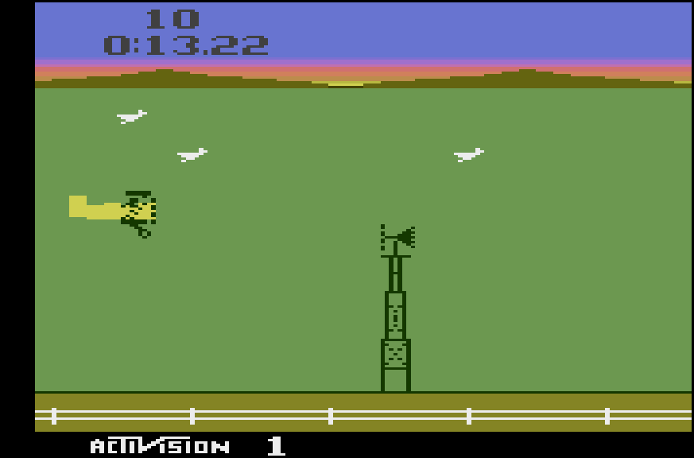
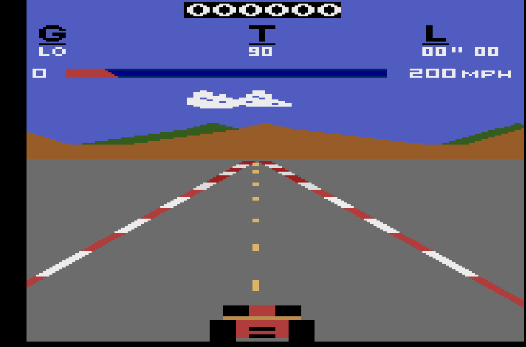
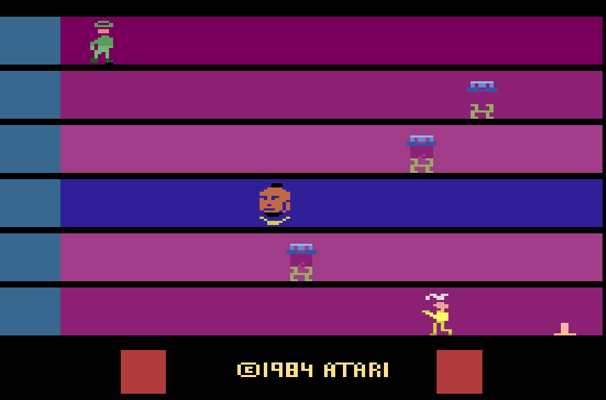
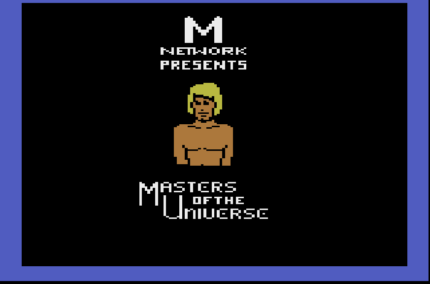
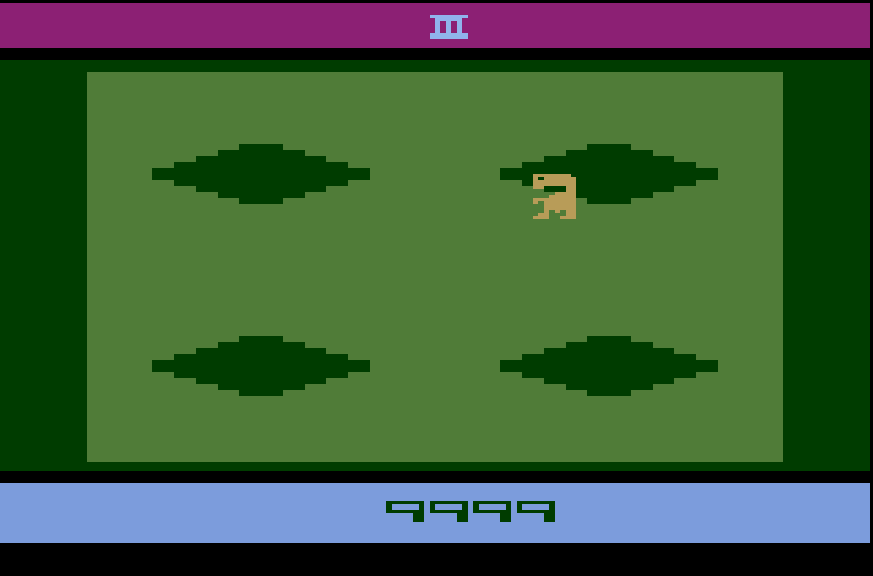
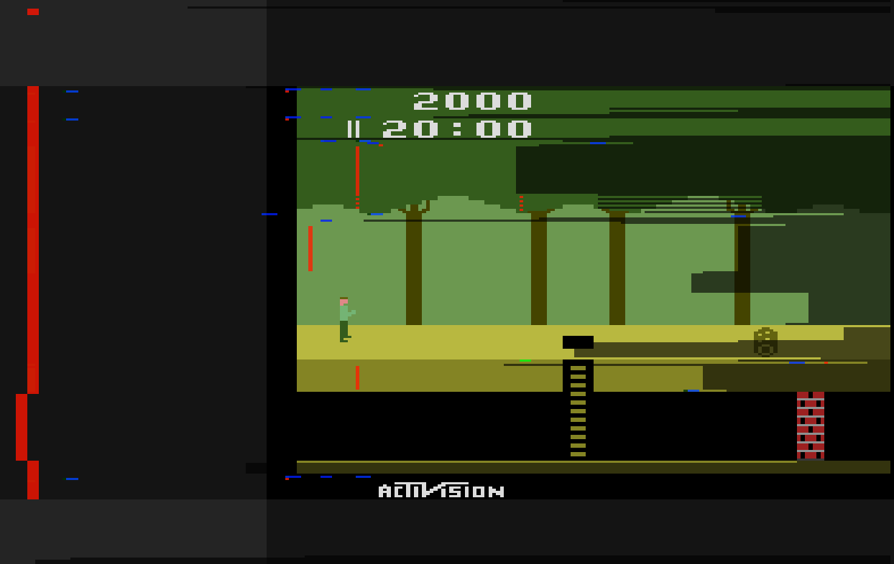
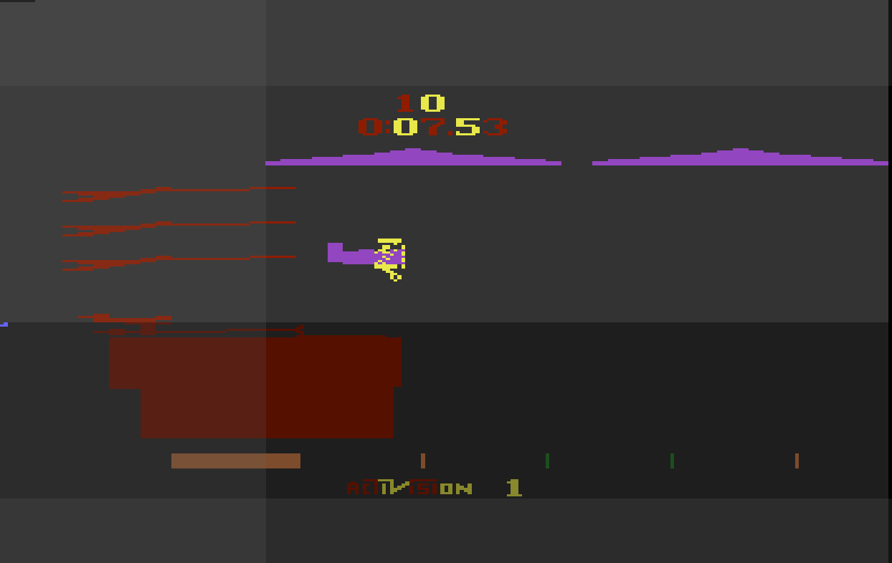
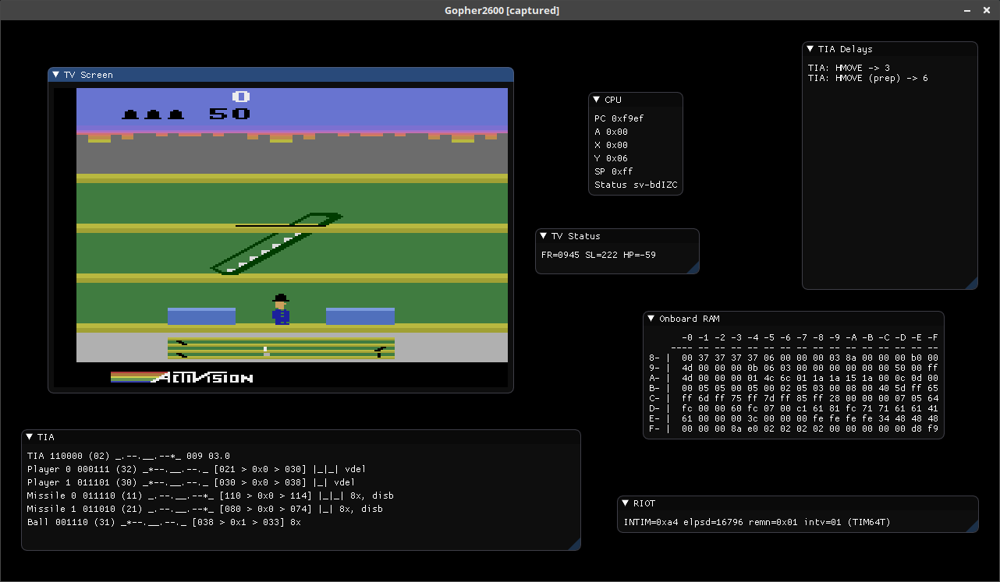

# Gopher2600

Gopher 2600 is a more-or-less complete emulation of the Atari VCS. It is
written in Go and was begun as a project for learning that language.

## Project Features

* Support for joystick, paddle and keyboard hand controllers
	* Auto-handling of input type *
* Debugger
	* Line terminal interface
	* CPU and Video stepping
	* Breakpoints, traps, watches
	* Script recording and playback
* Gameplay session recording and playback
* Regression database
	* useful for ensuring continuing code accuracy when changing the emulation code
* ROM patching
* Auto-detection of television specification *
* Setup preferences for individual ROMs
	* Television specification
	* Setting of panel switches
	* Automatic application of ROM patches

The asterisks in the list indicate that these features are experimental. They have performed
well during development but there will undoubtedly be cases when the systems fail. To mitigate
this, Gopher2600's setup system is available (although, as yet the specifying of input type
is not supported).

There is a lot to add to the project but the key ommissions as it currently stands are:

* Not all CPU instructions are implemented. Although adding the missing opcodes
	when encountered should be straightforward.
* Unimplemented cartridge formats
	* F0 Megaboy
	* AR Arcadia
	* X1 chip (as used in Pitfall 2)
* Disassembly of some cartridge formats is known to be inaccurate
* Television display does not handle out-of-spec TV signals as it should

## Performance

On a 3GHz i3 processor, the emulator (with SDL display) can reach 60fps or
thereabouts. 

## Screenshots

   

The screenshot below is of ET with the patches from http://www.neocomputer.org/projects/et/ automatically applied. Auto-patching of ROMs is a feature of the emulator

The final two screenshots show some debugging output. Interaction with the debugger is currently though a line terminal (or through a script) but even so, the screen display can be modified to display information useful to the programmer.

The Pitfall screenshot shows the debugging overlay. The additional coloured pixels indicate when key TIA events have occured. The most interesting part of this image perhaps, are the grey bars on the right of the image. These show WSYNC signal activity. This feature of the debugger needs a lot more work but even as it exists today was useful during the development of the emulator.

The second picture shows Barnstormer with the "debug colours" turned on. These debug colours are the same as you will see in the Stella emulator. Unlike Stella however, we can also see the off screen areas of the tv image, and in particular, the sprites as they "appear" off screen. Again, this visualisation proved useful to me when developing the emulator.

 

#### experimental interface

There is currently an effort to introduce a windowed debugger, using Dear Imgui. You can see the current state of the
project, which is by no means complete, with the '-imgui' flag

	> gopher2600 debug -imgui <rom>

The sreenshot below show Keystone Kapers with the debugging windows.

## Resources used

The Stella project (https://stella-emu.github.io/) was used as a reference for
video output. I made the decision not to use or even to look at any of Stella's
implementation details. The exception to this was a peek at the audio
sub-system. Primarily however, Gopher2600's audio implementation references Ron
Fries' original TIASound.c file.

Many notes and clues from the AtariAge message boards. Most significantly the
following threads proved very useful indeed:

* "Cosmic Ark Star Field Revisited"
* "Properly model NUSIZ during player decode and draw"
* "Requesting help in improving TIA emulation in Stella" 
* "3F Bankswitching"

And from and old mailing list:

* "Games that do bad things to HMOVE..." https://www.biglist.com/lists/stella/archives/199804/msg00198.html

These mailing lists and forums have supplied me with many useful test ROMs. I
will package these up and distribute them sometime in the future (assuming I
can get the required permissions).

Extensive references have been made to Andrew Towers' "Atari 2600 TIA Hardware
Notes v1.0"

Cartridge format information was found in Kevin Horton's "Cart Information
v6.0" file (sometimes named bankswitch_sizes.txt)

The "Stella Programmer's Guide" by Steve Wright is of course a key document,
used frequently throughout development.

The 6507 information was taken from Leventhal's "6502 Assembly Language
Programming" and the text file "64doc.txt" v1.0, by John West and Marko Makela.

## ROMs used during development

The following ROMs were used throughout development and compared with the
Stella emulator for accuracy. As far as I can tell the following ROMs work more
or less as you would expect:

### Commercial
* Pitfall
* Adventure
* Barnstormer
* Krull
* He-Man
* ET
* Fatal Run
* Cosmic Ark
* Keystone Kapers
* River Raiders
* Tennis
* Wabbit
* Yar's Revenge
* Midnight Madness

### Homebrew
* Thrust (v1.2)
* Hack'em (pac man clone)
* Donkey Kong (v1.0)

### Demos
* Tricade by Trilobit
* Chiphead by KK of Altair

## Compilation

The project has most recently been tested with Go v1.13.4. It will not work with
versions earlier than v1.13 because of language features added in that version
(binary literals).

The project uses the Go module system and dependencies will be resolved
automatically. Do note however, that you will required the SDL development
libraries for the Go SDL module to compile.

Compile with GNU Make

	> make build

During development, programmers may find it more useful to use the go command
directly

	> go run gopher2600.go

## Basic usage

Once compiled run the executable with the help flag:

	> gopher2600 -help

This will list the available sub-modes. USe the -help flag to get information
about a sub-mode. For example:

	> gopher2600 debug -help

To run a cartridge, you don't need to specify a sub-mode. For example:

	> gopher2600 roms/Pitfall.bin

Although if want to pass flags to the run mode you'll need to specify it.

	> gopher2600 run -help

## Hand Controllers

Joystick, paddle and keypad inputs are supported. Currently, only joysticks and paddles for the left player are available however. 

The joystick is operated via the cursor keys on the keyboard and the spacebar in place of the fire button.

The paddle is available through the mouse but only after the window has been clicked and the mouse "captured". The mouse pointer will disappear to indicate that the mouse has been captured. The paddle is operated by moving the mouse (or trackball) left and right and using the left button in place of the paddle's fire button. The mouse can be "released" by pressing the right mouse button. Note that if the game does not support or expect paddle input then the joystick will still work even if the mouse is "captured"

Keypad input is available only when the emulation thinks it is required. When keypad input is expected, neither joystick or paddle controls will work.

#### Joystick (left player)

* Cursor keys for stick direction
* Space bar for fire

#### Paddle (right player)

* Left mouse button in window to capture mouse
* Mouse left/right motion for paddle motion
* Left mouse button for paddle's fire button
* Right mouse button to leave "paddle mode"

#### Keypad

|   |VCS|   |
|:-:|:-:|:-:|
| 1 | 2 | 3 |		
| 4 | 5 | 6 |		
| 7 | 8 | 9 |		
| * | 0 | # |	 	

Using the guide above, we can see the corresponding keys on the PC keyboard for the left and right players.

|   |left|   |
|:-:|:-:|:-:|
| 1 | 2 | 3 |		
| q | w | e |		
| a | s | d |		
| z | x | c |	 	

|   |right|   |
|:-:|:-:|:-:|
| 4 | 5 | 6 |		
| r | t | y |		
| f | g | h |		
| v | b | n |	 	

#### Panel

The VCS panel is controlled through the function keys of the keyboard.

* F1 Panel Select
* F2 Panel Reset
* F3 Color Toggle
* F4 Player 0 Pro Toggle
* F5 Player 0 Pro Toggle

## Debugger

To run the debugger use the DEBUG submode

	> gopher2600 debug roms/Pitfall.bin

The debugger is line oriented, which is not ideal I admit but it works quite well. Help is available with the HELP command. Help on a specific topic is available by specifying a keyword. The list below shows the currently defined keywords. The rest of the section will give a brief run down of debugger features.

	[ 0xf000 SEI ] >> help
	         AUDIO          BALL         BREAK     CARTRIDGE         CLEAR
	           CPU   DISASSEMBLY       DISPLAY          DROP          GREP
	          HELP        INSERT          LAST          LIST        MEMMAP
	       MISSILE        ONHALT        ONSTEP         PANEL         PATCH
	          PEEK        PLAYER     PLAYFIELD          POKE       QUANTUM
	          QUIT           RAM         RESET           RUN        SCRIPT
	          STEP         STICK        SYMBOL           TIA         TIMER
	          TRAP            TV         WATCH

The debugger allows tab-completion in most situations. For example, pressing `W` followed by the Tab key on your keyboard, will autocomplete the `WATCH` command. This works for command arguments too. It does not currently work for filenames, or symbols. Given a choice of completions, the Tab key will cycle through the available options.

Addresses can be specified by decimal or hexadecimal. Hexadecimal addresses can be writted `0x80` or `$80`. The debugger will echo addresses in the first format. Addresses can also be specified by symbol if one is available. The debugger understands the canonical symbol names used in VCS development. For example, `WATCH NUSIZ0` will halt execution whenever address 0x04 (or any of its mirrors) is written to. 

Watches are one of the three facilities that will halt execution of the emulator. The other two are `TRAP` and `BREAK`. Both of these commands will halt execution when a "target" changes or meets some condition. An example of a target is the Programmer Counter or the Scanline value. See `HELP BREAK` and `HELP TRAP` for more information.

Whenever the emulation does halt, the `ONHALT` command will run. For example, a previous call to `ONHALT CPU` will cause the `CPU` command to run whenever the emulation stops. Similarly, the `ONSTEP` command applies whenever the emulation is stepped forward. By default, the `LAST` command is run on every step.

The debugger can step forward either, one CPU instruction at a time, or by one video cycle at a time. We can change this mode with the `QUANTUM` command. We can also conveniently use the `STEP` command, for example `STEP VIDEO`, performing the quantum change and stepping forward in one go. The `STEP` command can also be used to run until the next time a target changes. For example, `STEP SCANLINE`. Using `STEP` in this way is often more useful than setting up a `TRAP`.

Scripts can be recorded and played back with the `SCRIPT` command. All commands are available when in script recording mode, except `RUN` and further `SCRIPT RECORD` command. Playing back a script while recording a new script is possible.

On startup, the debugger will load a configuration script, which consists of debugger commands available at the debugger's command line. A useful startup script would be:

	DISPLAY SCALE 3.0
	DISPLAY
	
This opens the debugger with the debugging screen open and ready for use. See the section "Configuration Directories" for more information.

### Debugger's Screen Display

When the debugger's screen display is active, the VCS can be controlled in the manner described above in the Hand Controllers and Panel sections. In addition to those controls, the following keys are only available in the debugger (and when the screen display is active)

* F12 (backtick) Toggle screen masking
* F11 Toggle debugging colors
* F10 Toggle debugging overlay
* \+ Increase screen size
* \- Decrease screen size

Note that all user input is accessible through debugging commands. This is useful for scripting.

## Configuration Directory

Gopher2600 will look for certain files in a configuration directory. The location
of this directory depends on whether the executable is a release executable (built
with "make release") or a development executable (made with "make build"). For
development executables the configuration directory is named `.gopher2600` and is 
located in the current working directory.

For release executables, the directory is placed in the user's configuration directory,
the location of which is dependent on the host OS. On modern Linux systems, the location
is `.config/gopher2600`.

In both instances, the directory, sub-directory and files will be created automatically
as required.

## Recording Gameplay

Gopher2600 can record all user input and playback for future viewing. This is a very efficient way
of recording gameplay and results in far smaller files than a video recording. It also has other uses,
not least for the recording of complex tests for the regression database.

To record a gameplay session, use the `record` flag. Note that we have to specify the `run` mode for the
flag to be recognised:

	> gopher2600 run -record roms/Pitfall.bin
	
This will result in a recording file in your current working directory, with a name something like:

	> recording_Pitfall_20200201_093658
	
To playback a recording, simply specify the recording file instead of a ROM file:

	> gopher2600 recording_Pitfall_20200201_093658

## Regression Database

#### Adding

To help with the development process a regression testing system was added. This will prove
useful during further development. To quickly add a ROM to the database:

	> gopher2600 regress add roms/Pitfall.bin

By default, this adds a "screen digest" of the first 10 frames of the named ROM. We can alter the
number of frames, and also other parameters with `regress add` mode flags. For example, to run for
100 frames instead of 10:

	> gopher2600 regress add -frames 100 roms/Pitfall.bin

The database also supports the adding of playback files. When the test is run, the playback file
is run as normal and success measured. To add a playback to the test data, simply specify the playback
file instead of a rom:

	> gopher2600 regress add recording_Pitfall_20200201_093658

#### Listing

To listing all previously add tests use the "list" sub-mode:

	> gopher2600 regress list
	> 000 [digest/video] player_switching [AUTO] frames=10  [NUSIZ]
	> 001 [digest/video] NUSIZTest [AUTO] frames=10  [NUSIZ]
	> 002 [digest/video] testSize2Copies_A [AUTO] frames=10  [NUSIZ]
	> 003 [digest/video] testSize2Copies_B [AUTO] frames=10  [NUSIZ]
	> 004 [digest/video] player8 [AUTO] frames=10  [NUSIZ]
	> 005 [digest/video] player16 [AUTO] frames=10  [NUSIZ]
	> 006 [digest/video] player32 [AUTO] frames=10  [NUSIZ]
	> 007 [digest/video] barber [AUTO] frames=10  [NUSIZ]
	> 008 [digest/video] test1.bas [AUTO] frames=10  [TIMER]
	> 009 [digest/video] test2.bas [AUTO] frames=10  [TIMER]
	> 010 [playback] playback_player_20200127_172838 [HMOVE/BAD THINGS]
	> Total: 11

#### Running

To run all tests, use the `run` sub-mode:

	> gopher2600 regress run

To run specific tests, list the test numbers (as seen in the list command result)
on the command line. For example:

	> gopher2600 regress run 1 3 5

#### Deleting

Delete tests with the `delete` sub-mode. For example:

	> gopher2600 regress delete 3

## ROM Setup

The setup system is currently available only to those willing to edit the "database" system by hand.
The database is called `setupDB` and is located in the project's configuration directory. The format
of the database is described in the setup package. Here is the direct link to the source
level documentation: https://godoc.org/github.com/JetSetIlly/Gopher2600/setup

## WASM / HTML5 Canvas

To compile and serve a WASM version of the emulator (no debugger) use:

	> make web

The server will be listening on port 2600. Note that you need a file in the
web2600/www folder named "example.bin" for anything to work.

Warning that this is a proof of concept only. The performance is currently
very poor.

## Futher Help

In addition to this readme, more information can be found with the command line `-help` system.
Many modes and sub-modes will accept operational flags. Specifying the `-help` flag will print
a brief summary of available options.

Help on debugger commands is available with the `HELP` command at the debugger command line.

More information is available in the Go source files and can be viewed with the
Go documenation system. With `godoc` installed:

	> GOMOD=$(pwd) godoc -http=localhost:1234 -index >/dev/null &

Alternatively, the most current version of the docs available on github can be viewed 
at https://godoc.org/github.com/JetSetIlly/Gopher2600

Finally, development and maintenance documentation is beginning to be stored in its
own Github repository: https://github.com/JetSetIlly/Gopher2600-Dev-Docs
