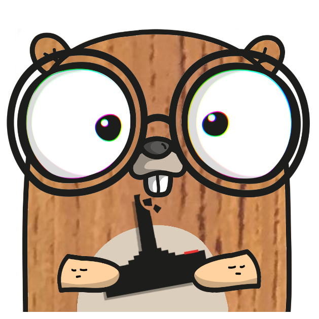

# Gopher2600

`Gopher2600` is an emulator for the Atari 2600 written in the Go language. The accuracy of the emulation is very high and the 6507, TIA and RIOT chips appear to operate without bugs. Certainly, there are no known outstanding issues with any of the emulated chips. It compares favourably with `Stella` except for [speed](#performance) and final project polish. 
 

The key features of the emulator:

* [Support for many of the known cartridge formats](#supported-cartridge-formats)
* Emulation of the [ARM7TDMI](#arm7tdmi-emulation) as found in the `Harmony` cartridge
* [Gameplay recording and playback](#recording-gameplay)
* Support for (and auto-detection of) [stick, paddle and keypad](#hand-controllers)
* Network access through [PlusROM](#plusrom) emulation
* [Savekey](#savekey) support
* [CRT Effects](#crt-effects)
* Accurate audio reproduction (and optional stereo output)
* Support for common [TIA revisions](#tia-revisions)
* Implementation of [Movie Cart](#movie-cart)
* [Gameplay rewinding](#rewinding)
* Tracker/Piano Keys visualisation

The graphical [debugger](#debugger) includexe:

* Color Clock level interaction
* Breakpoints, traps, watches on various CPU, TIA, RIOT targets
* Specialist windows for specific cartridge types (eg. supercharger tape)
* Line [terminal](#debugger-terminal) interface for harder to reach parts of the emulation
* Script recording and playback
* [Regression Database](#regression-database)

Logo is based on [Gopherize.me](https://github.com/matryer/gopherize.me) which itself is based on the work of [Ashley McNamara](https://github.com/ashleymcnamara/gophers) and is [licensed under the Creative Commons](https://github.com/ashleymcnamara/gophers/blob/master/LICENSE).

## Example Screenshots

The following [screenshots](#screenshots) were taken in playmode with CRT effects enabled.

<table align="center">
	<tr>
		<td align="center">
			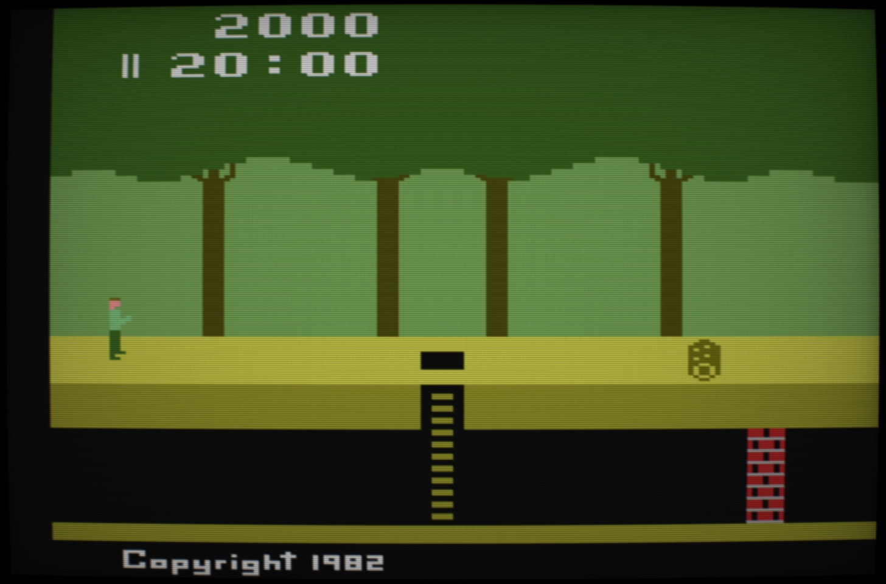
		</td>
		<td align="center">
			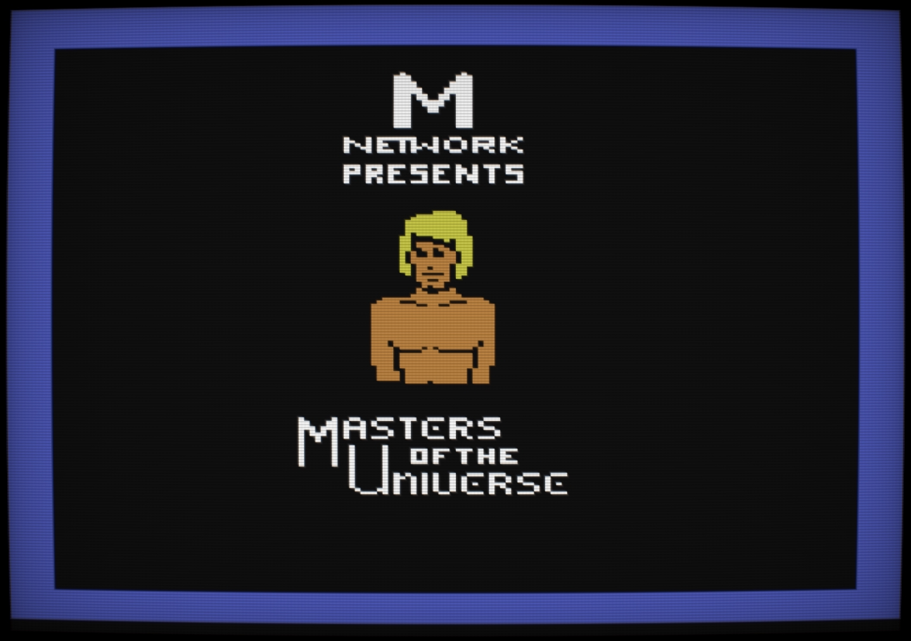
		</td>
	</tr>
	<tr>
		<td align="center">
			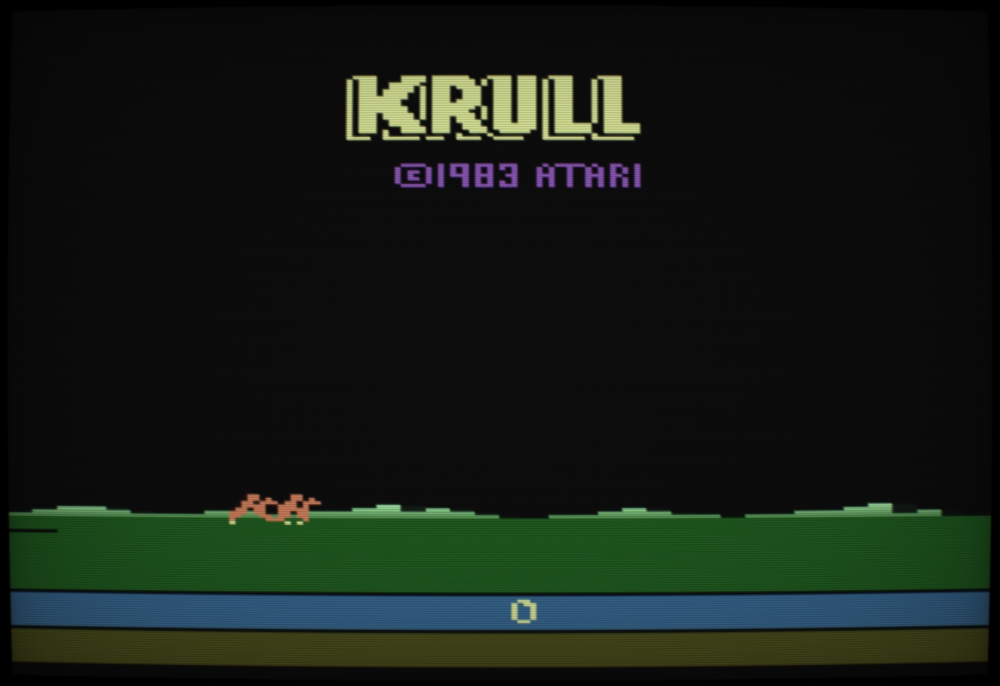
		</td>
		<td align="center">
			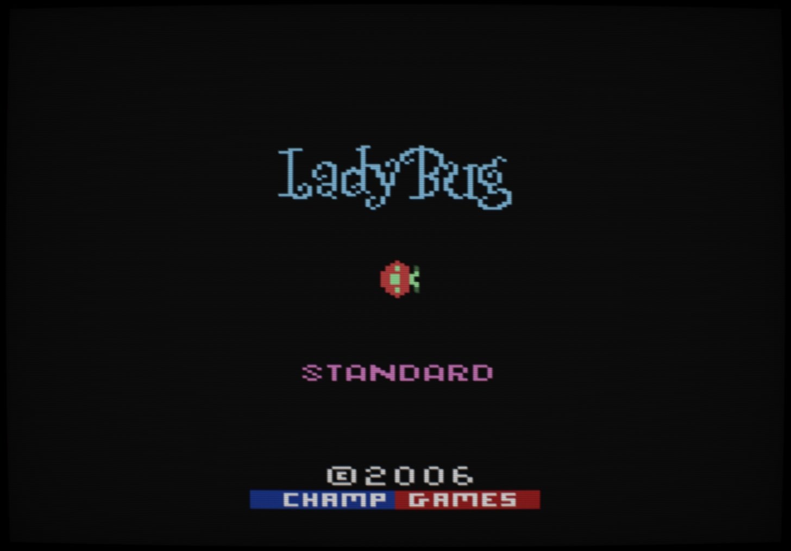
		</td>
	</tr>
	<tr>
		<td align="center">
			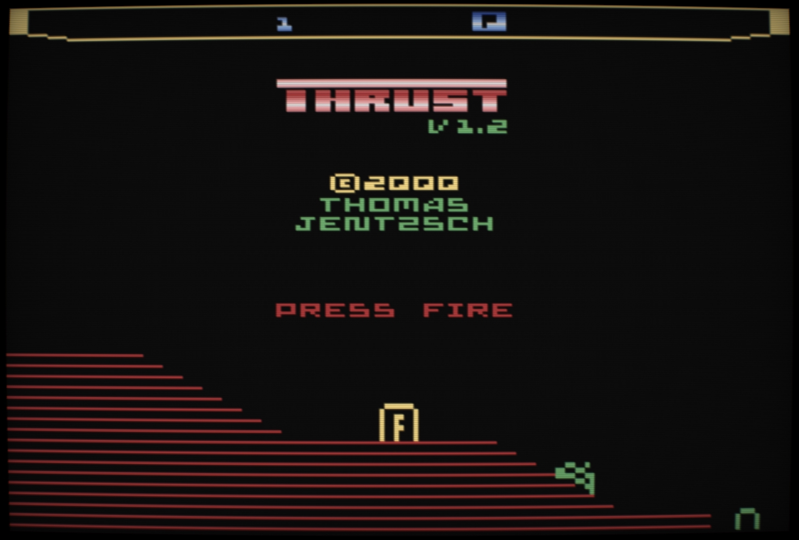
		</td>
		<td align="center">
			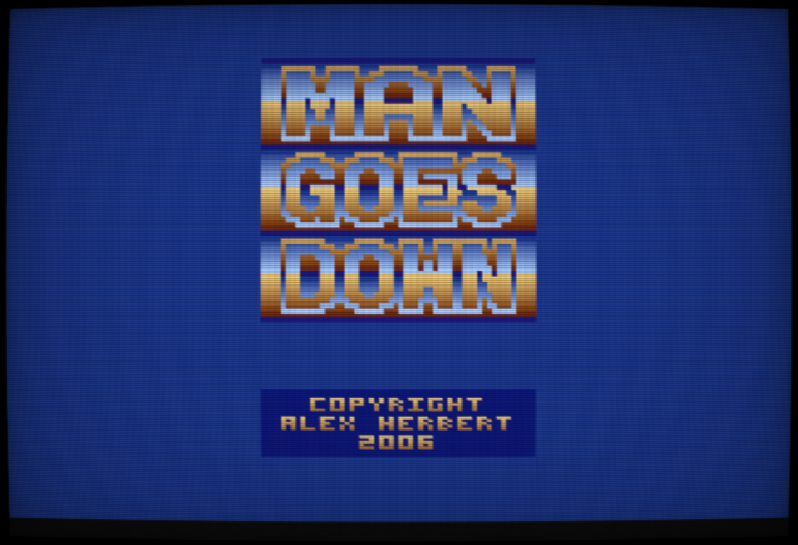
		</td>
	</tr>
	<tr>
		<td align="center">
			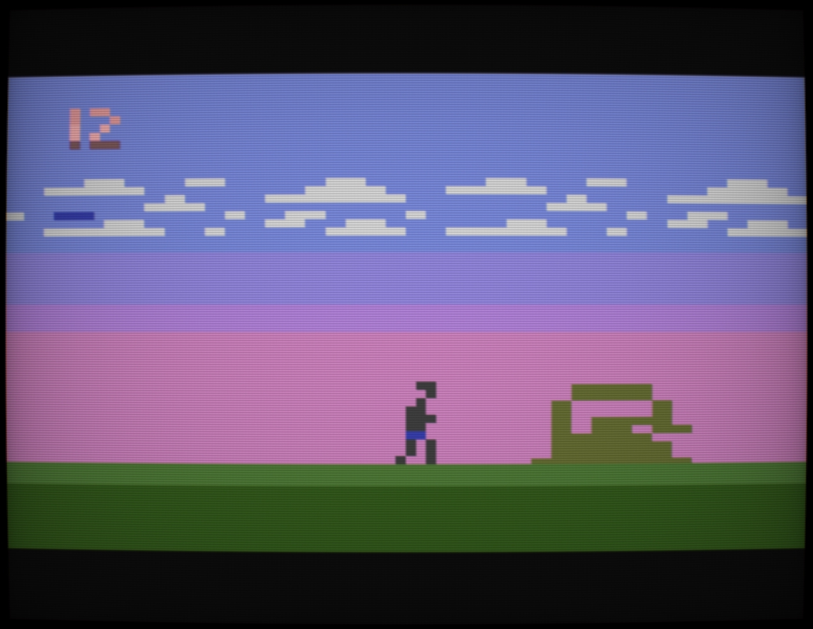
		</td>
		<td align="center">
			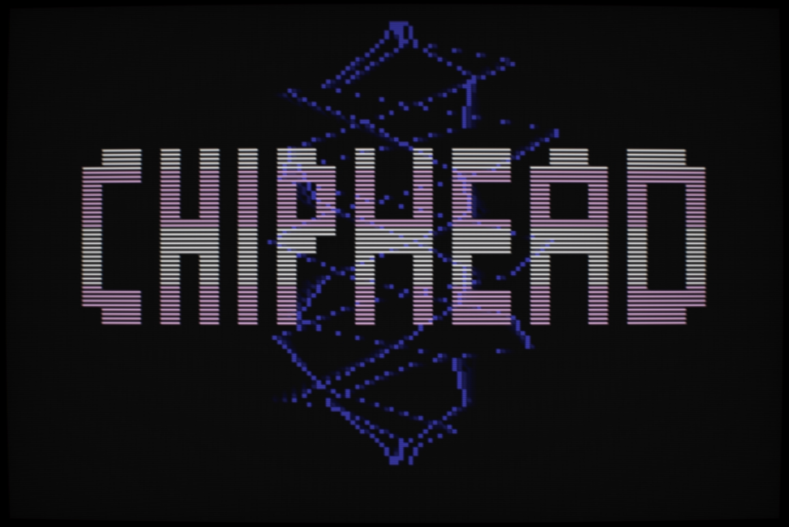
		</td>
	</tr>
	<tr>
		<td align="center">
			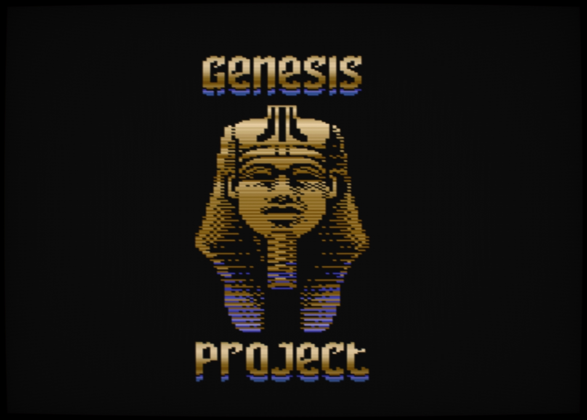
		</td>
		<td align="center">
			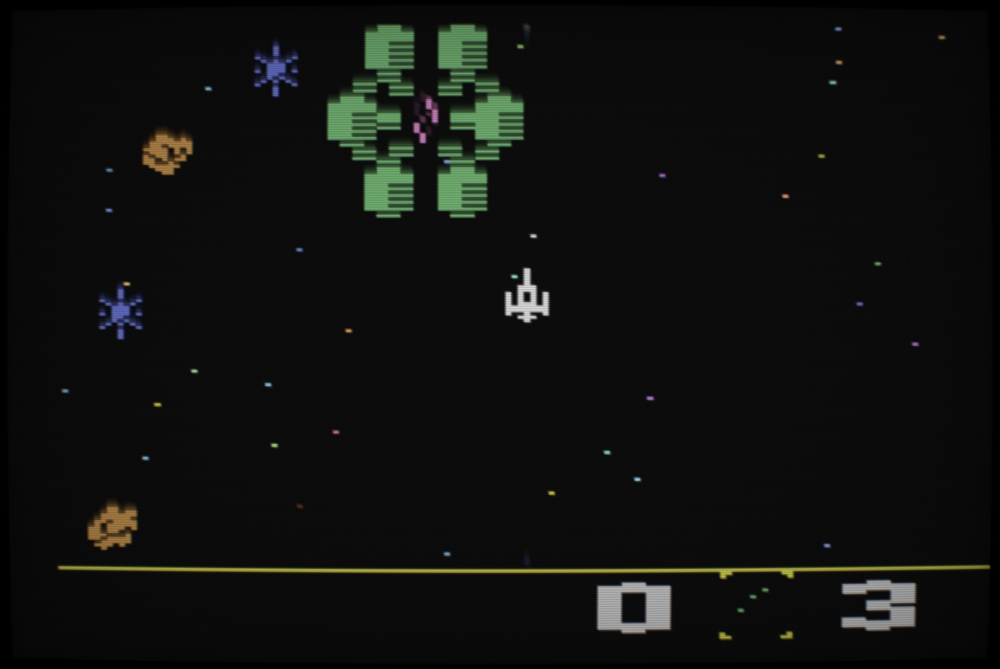
		</td>
	</tr>
	<tr>
		<td align="center">
			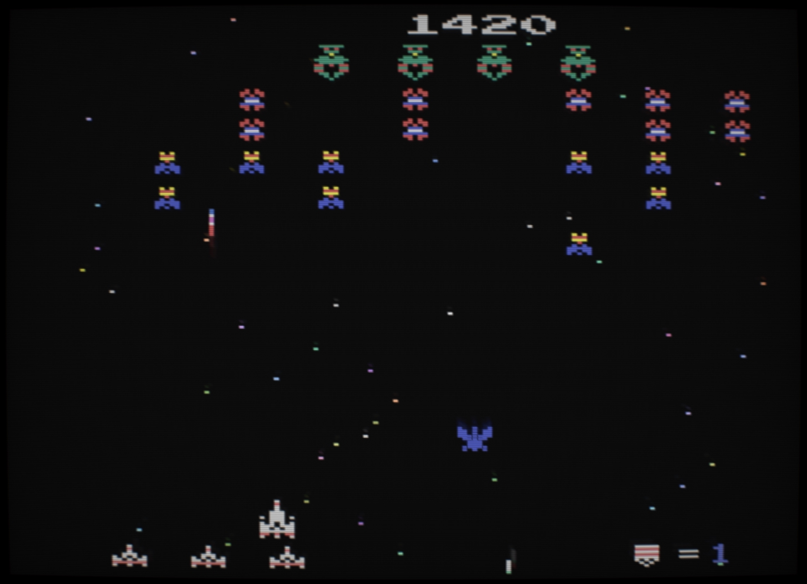
		</td>
		<td align="center">
			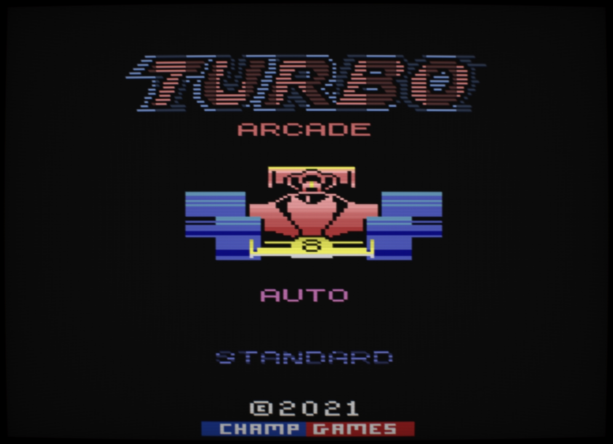
		</td>
	</tr>
	<tr>
		<td align="center">
			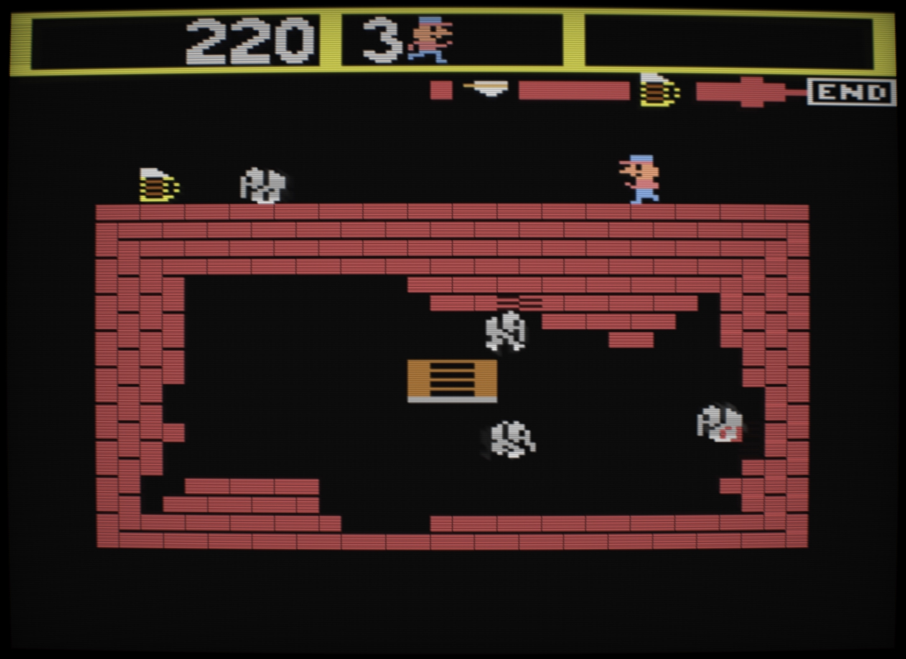
		</td>
		<td align="center">
			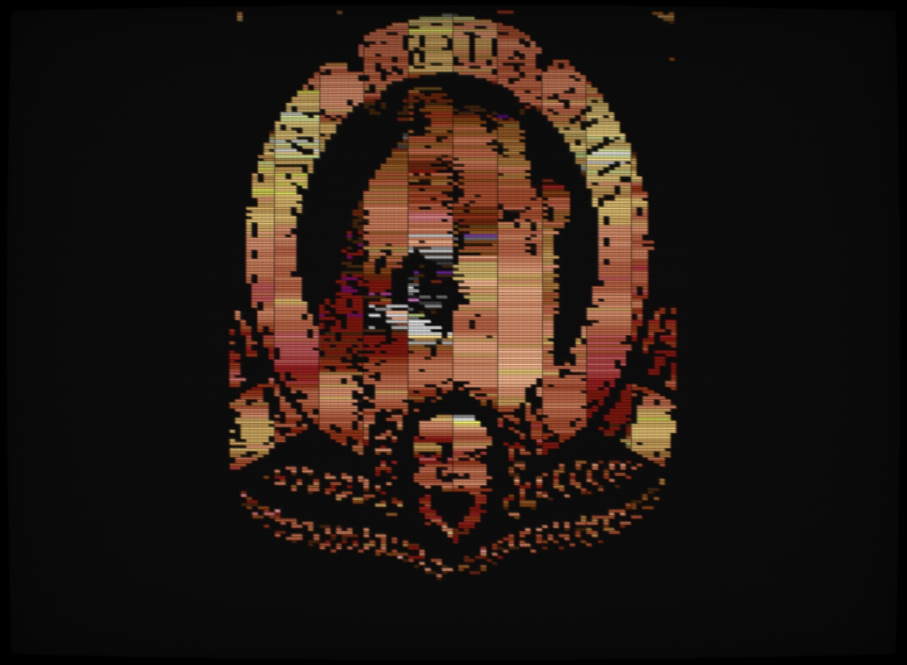
		</td>
	</tr>
</table>

Games shown: Pitfall; He-Man; Krull; Ladybug; Thrust; Man Goes Down; [Soul of the Beast](https://aeriform.itch.io/beast); Chiphead; Egypt 2600BC by Genesis Project; Draconian; [Galagon](https://champ.games/downloads); [Turbo](https://champ.games/downloads); [Zookeeper](https://champ.games/downloads); [Movie Cart](#movie-cart).

## Scope of the project

`Gopher2600` was started as for fun and educational purposes, as way of
learning more about the `Atari 2600` and also about the
[Go programming language](https://golang.org/).

The original intent was to create a tool for static analysis of a 6507 program
to help in the creation of `Atari 2600` games. I soon realised however that I
would need to emulate more of the 2600 and not just the CPU for this to be
useful.

Because of its origins, any flaws or limitations in the design should be borne
in mind while the project is still in development. [I am open to any suggestions
on how to improve the project](#self-reflection).

## Performance

The development machine for `Gopher2600` was an i3-3225 with 16GB of RAM. Host
operating system throughout the development has been a Linux system (4.x
series).

In playmode I can get a sustained frame rate of 60fps capped and 113fps
uncapped. In debug mode, I can get around 42fps. 

To get a performance rating for your installation you can run the following:

	> gopher2600 performance -fpscap=false <rom file>

For performance measurement with the display you can press the `F7` key while
playing a ROM to bring up the `FPS indicator`. 

Memory usage is currently around 40MB of system memory in playmode and around 120MB in
debug mode. This can vary on the ROM used however. It shouldn't ever be a
problem on modern hardware.

A `statsview` is also available. See the section below on the [Statistics
Viewer](#statistics-viewer) for details.

#### Improving Performance

There are very few options available to improve performance of the emulator.

One thing you can do is to compile the project with at least version 1.17 of
the Go compiler.

Turning CRT effects off will likely have no effect.

For ROMs that use the [ARM](#arm7tdmi-emulation) chip, setting the ARM to
`immediate mode` will eliminate cycle counting and hence give a modest
performance boost. 

## Compilation

The project has most recently been tested with Go v1.17.

The project uses the Go module system and dependencies will be resolved
automatically. Do note however, that you will also require the SDL development
kit installed on the system. For users of UNIX like systems, installation from
your package manager is the easiest option (for MacOS use the homebrew package
manager https://formulae.brew.sh/formula/sdl2)

Compile with GNU Make

	> make release

During development, programmers may find it more useful to use the go command
directly

	> go run gopher2600.go
	
### Minimum requirements

`Gopher2600` makes use of SDL2. The SDL2 go binding used by the project requires a minimum
SDL2 version of `2.0.10`.

### Platforms

`Gopher2600` is known to run on several platforms. It is known to work best
however on Linux based systems, on which it is being developed. 

### Cross-Compilation

Native compilation of a Windows executable has not yet been tried. But
cross-compilation does work via the Makefile:

	> make cross_windows

Or for a statically linked binary:
	
	> make cross_windows_static

This has been tested on a Linux system with mingw installed.

## Basic usage

Once compiled run the executable with the help flag:

	> gopher2600 -help

This will list the available sub-modes. Use the -help flag to get information
about a sub-mode. For example:

	> gopher2600 debug -help

To run a cartridge, you don't need to specify a sub-mode. For example:

	> gopher2600 roms/Pitfall.bin

Although if want to pass flags to the run mode you'll need to specify it.

	> gopher2600 run -help

## Hand Controllers

Stick, paddle and keypad inputs are supported.

### Stick

The stick is the most common control method for `Atari 2600` games. The
left-side player is controlled with the following keys.

<table>
	<tr>
		<th colspan=2>Left-Side Player</th>
	</tr>
	<tr>
		<td align="center">Cursor Keys</td>
		<td align="center">Stick Direction</td>
	</tr>
	<tr>
		<td align="center">Space</td>
		<td align="center">Fire Button</td>
	</tr>
</table>

The right-side player is controlled with the following keys.

<table>
	<tr>
		<th colspan=2>Right-Side Player</th>
	</tr>
	<tr>
		<td align="center">G</td>
		<td align="center">Left</td>
	</tr>
	<tr>
		<td align="center">J</td>
		<td align="center">Right</td>
	</tr>
	<tr>
		<td align="center">Y</td>
		<td align="center">Up</td>
	</tr>
	<tr>
		<td align="center">H</td>
		<td align="center">Down</td>
	</tr>
	<tr>
		<td align="center">F</td>
		<td align="center">Fire Button</td>
	</tr>
</table>

The stick for the left-side player can also be controlled with a [gamepad](#gamepad).

### Paddle

The paddle for the left-side player can be controlled with the mouse or a [gamepad](#gamepad).

In the case of the mouse, the mouse must be [captured](#mouse-capture).

Neither of these input methods is a perfect replacement for a real paddle
however and which device is used depends on the game. For some games, the
triggers will suffice but other games will perform better when using the mouse.

`Nightdriver` is an example of a game that plays well with the triggers,
whereas experience says that `Circus Tricks` is better played with the mouse.

The paddle for the right-side player is not currently supported.

### Keypad

Keypad input for both players is supported. 

<table>
	<tr>
		<th colspan=3>Left-Side Player</th>
		<th></th>
		<th colspan=3>Right-Side Player</th>			
	</tr>
	<tr>
		<td align="center">1</td>
		<td align="center">2</td>
		<td align="center">3</td>
		<td></td>
		<td align="center">4</td>
		<td align="center">5</td>
		<td align="center">6</td>
	</tr>
	<tr>
		<td align="center">q</td>
		<td align="center">w</td>
		<td align="center">e</td>
		<td></td>
		<td align="center">r</td>
		<td align="center">t</td>
		<td align="center">y</td>
	</tr>
	<tr>
		<td align="center">a</td>
		<td align="center">s</td>
		<td align="center">d</td>
		<td></td>
		<td align="center">f</td>
		<td align="center">g</td>
		<td align="center">h</td>
	</tr>
	<tr>
		<td align="center">z</td>
		<td align="center">x</td>
		<td align="center">c</td>
		<td></td>
		<td align="center">v</td>
		<td align="center">b</td>
		<td align="center">n</td>
	</tr>
</table>

### Auto-Detection

`Gopher2600` supports auto-detection of input devices. In general, this is done
by 'waggling' the control a few times in order to wake up the device.

On startup, the stick is assumed to be the controller of choice.

In the case of keypad controllers, it's possible for the emulation to detect
for certainty that a keypad controller is required. It is therefore not
possible to switch to or from keypad control manually because there is no
need.

### Gamepad

For convenience the joystick and paddle for the left-side player can be
controlled through a gamepad. For the joystick, use the left thumbstick or the
DPad. Any of the face buttons will act as the joystick's fire button.

To control the paddle use the left and right analogue triggers. Note that you
will need to 'waggle' the triggers a couple of times for the emulator to detect
that you want to switch to the paddle.

When in `playmode` the gamepad has some additional functionality:

The console's reset switch can be triggered with the gamepad's `start` button,
whilst the `back` button pauses and unpauses the emulation.

The bumper/shoulder button can be used to rewind the gameplay.

The `guide` button will switch to the debugger.

These button combinations will likely change in the future.

### Mouse Capture

When using the mouse for paddle control, the mouse must first be 'captured'.
You will know when the mouse is captured because the mouse pointer will no
longer be visible.

In playmode, the mouse is most conveniently caputred by pressing the right
mouse button. To release the mouse from capture press the right mouse button.
The `Scroll Lock` key will also toggle mouse capture.

In the debugger, there is a `Capture Mouse` button in the `Control` window. Or
you can use the `Scroll Lock` key.

### Panel

The VCS panel is controlled through the function keys of the keyboard.

* `F1` Panel Select
* `F2` Panel Reset
* `F3` Colour Toggle
* `F4` Player 0 Pro Toggle
* `F5` Player 1 Pro Toggle

## Emulation Hotkeys

* `ESC` Quit
* `F9` Show Audio Tracker Window
* `F10` Show Preferences Window
* `F11` Toggle Fullscreen
* `F12` Save [Screenshot](#screenshots)
* `Scroll Lock` Toggle mouse capture (`F14` on some keyboards)
* `Pause` Pause/Resume emulation (`F15` on some keyboard)

In playmode only: 

* `F7` FPS Indicator
* `Tab` Opent the ROM selector

The final hotkey switches between the playmode and the debugger. I'll describe
this key as the `key below the Escape key`.

What this key is differs from keyboard to keyboard - in the UK it is the `back
tick` key while on US keyboards it is the `tilde` key. Regardless, the key was
chosen because it the same key that is used by default in `Stella`.

## Debugger

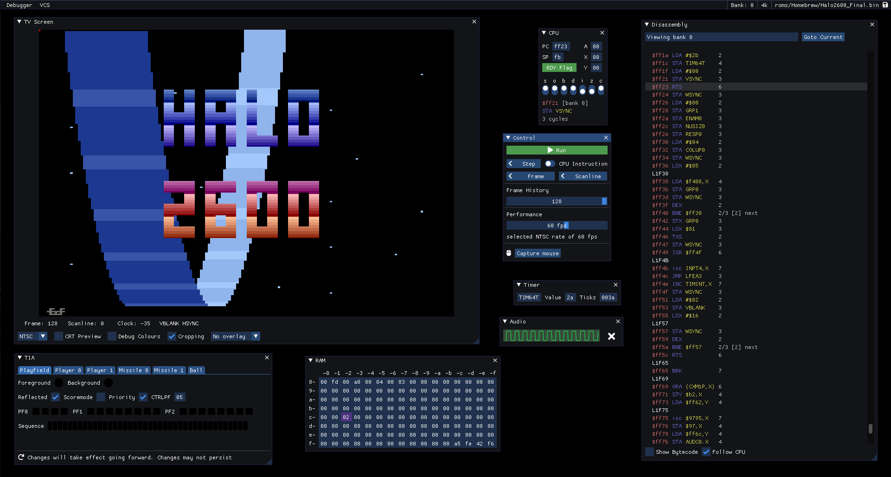

The screenshot above shows a typical window layout of the debugger. The menu
bar at the top provides more windows, some of which are specific to certain
cartridge mappers. For example, for cartridges with a `ARM7TDMI` an ARM
disassembly window is provided.

#### Debugger Terminal

As an alternative to GUI interaction the debugger can also be controlled through a terminal. This is available through the `terminal` window. The rest of this section describes the operation of the terminal in detail.

Help is available with the HELP command. Help on a specific topic is available
by specifying a keyword. The list below shows the currently defined keywords.
The rest of the section will give a brief run down of debugger features.

	[ $f000 SEI ] >> help
        AUDIO         BALL        BREAK    CARTRIDGE        CLEAR   CONTROLLER
          CPU       DISASM      DISPLAY         DROP         GOTO         GREP
         HALT         HELP       INSERT       KEYPAD         LAST         LINT
         LIST          LOG       MEMMAP     MEMUSAGE      MISSILE       ONHALT
       ONSTEP      ONTRACE        PANEL        PATCH         PEEK       PLAYER
    PLAYFIELD      PLUSROM         POKE      QUANTUM         QUIT          RAM
        RESET       REWIND         RIOT          RUN       SCRIPT         STEP
        STICK       SYMBOL          TIA        TRACE         TRAP           TV
        WATCH
	
The debugger allows tab-completion in most situations. For example, pressing `W` followed by the Tab key on your keyboard, will autocomplete the `WATCH` command. This works for command arguments too. It does not currently work for filenames, or symbols. Given a choice of completions, the Tab key will cycle through the available options.

Addresses can be specified by decimal or hexadecimal. Hexadecimal addresses can be written `0x80` or `$80`. The debugger will echo addresses in the first format. Addresses can also be specified by symbol if one is available. The debugger understands the canonical symbol names used in VCS development. For example, `WATCH NUSIZ0` will halt execution whenever address 0x04 (or any of its mirrors) is written to. 

Watches are one of the three facilities that will halt execution of the emulator. The other two are `TRAP` and `BREAK`. Both of these commands will halt execution when a "target" changes or meets some condition. An example of a target is the Programmer Counter or the Scanline value. See `HELP BREAK` and `HELP TRAP` for more information.

Scripts can be recorded and played back with the `SCRIPT` command. All commands are available when in script recording mode, except `RUN` and further `SCRIPT RECORD` command. Playing back a script while recording a new script is possible.

#### Rewinding

`Gopher2600` allows emulation state to be rewound to an earlier frame, scanline
or colour-clock. 

The `timeline` window allows you to move to any frame available in the rewind
history. The available history is indicated by the orange line. The current
frame is indicated by the orange circle.

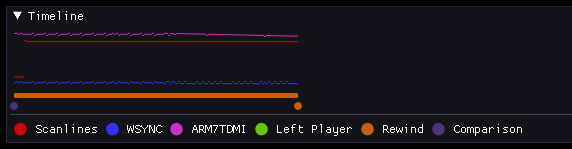

Hovering over the timeline will show details of the frame (number of scanlines,
percentage of WSYNC usage, etc.) and thumbnail preview. Clicking on the
timeline will instantly take the emulation to that state.

The `TV Screen` window is fully interactive and clicking or dragging on any
portion of the screen will take the emulation to that scanline/clock of the
current frame.

##### Rewind History Size

(How rewind states are stored is an area of current development. This section
will change in the near future)

The number of rewind states stored can be set via the preferences window (or
through the terminal). The more rewind states that can be stored the more
memory on your computer is required.

The snapshot frequency can also be altered. The frequency defines how many
frames must pass before another snapshot is taken.

The frequency does not affect the granularity of the rewind history however.
This means that you can rewind to any frame in the rewind history even if the
frame falls in between the snapshot frequency.

Currently however, a large snapshot frequency can bman user input can be lost.
Future version of the emulator will correct this.

## TIA Revisions

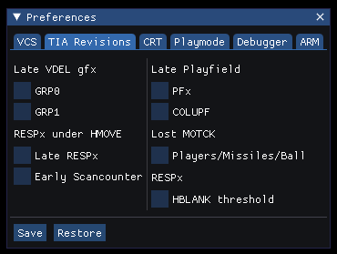

`Gopher2600` supports common revisions in the TIA chip and can be changed
through the prefrences window. 

In playmode the preferences window can by opened by pressing `F10`. Select the
`TIA Revisions` tab:

A summary of the known TIA revisions / bugs can be found at on [Atari Compendium](http://www.ataricompendium.com/faq/vcs_tia/vcs_tia.html). Not all revisions / bugs are supported by `Gopher2600`
but the common ones are.
 

## CRT Effects

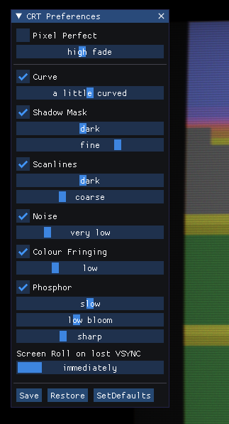

`Gopher2600` tries to emulate the visual effect of a CRT television. This is by
no means complete and is an area of active development.

In playmode the preferences window can by opened by pressing `F10`. Select the
`CRT` tab:

In the debugger the preferences window can be opened from the `Debugger` menu
and a preview can be seen in the `TV Screen` by pressing the `CRT Preview`
checkbox.

The effects can be turned off completely with the `Pixel Perfect` option. In
this mode, there is still the option to specify pixel fade. This is roughly
equivalent to the `phosphor` effect.

## Screenshots

`Gopher2600` offers three methods for creating a screenshot. Ideally, the
emulation will select the best method to use but this is currently not
possible (although this is an ongoing area of research).

The most basic method is the 'single frame' method. Press `F12` without any
modifiers and a single image is saved to the working directory (or working
folder for Windows users). 

The 'double frame' method is useful for kernels that use a two-frame flicker
kernel. In this method two consecutive frames are blended together to create a
single image. This method is selected by pressing either `shift` key at the
same time as the `F12` key.

The 'triple frame' method meanwhile, the image is created by belnding three
consecutive frames together. This is useful for the far rarer three-frame
flicker kernel. This method is selected by pressing either `ctrl` key at the
same time as the `F12` key.

In the case of both the double and triple frame methods, multiple 'exposures'
are made and saved (currently five). This is because it is not possible to
guarantee the generation of a good image from a single exposure in all
circumstances. From the exposures that are made the user can select the best
image; and if absolutely necessary, make a composite image.

Screenshot filenames will include whether the CRT effects were enabled, the
name of the ROM file (without extension), the date/time (to make the filename
unique) and the screenshot method (along with frame exposure).

Some examples:

* crt_Keystone_20210522_190921.jpg
* crt_CDFJChess_20210522_191008_triple_3.jpg
* pix_zookeeper_20200308_demo2_NTSC_20210522_190245_double_1.jpg

The dimensions of the image will be the same as the displayed screen (without
any window padding).

## Configuration Directory

`Gopher2600` will look for certain files in a configuration directory. The location
of this directory depends on whether the executable is a release executable (built
with "make release") or a development executable (made with "make build"). For
development executables the configuration directory is named `.gopher2600` and is 
located in the current working directory.

For release executables, the directory is placed in the user's configuration directory,
the location of which is dependent on the host OS. On modern Linux systems, the location
is `.config/gopher2600`.

For MacOS the directory for release executables is `~/Library/Application Support/gopher2600`

For Windows, a `gopher2600` will be placed somewhere in the user's `%AppData%`
folder, either in the `Local` or `Roaming` sub-folder.

In all instances, the directory, sub-directory and files will be created automatically
as required.

## Supercharger ROMs

`Gopher2600` can load supercharger tapes from MP3 and WAV file, in addition to supercharger BIN files.

Multiload "tapes" are supported although care should be taken in how multiload files are created. 

In the case of BIN files a straight concatenation of individual files should
work, resulting in a file that is a multiple of 8448 bytes.

For MP3 and WAV files however, the *waveform* should be concatenated, not the
individual MP3/WAV files themselves. A command line tool like
[SoX](https://github.com/chirlu/sox) can be used for this.

### Supercharger BIOS

Supercharger eulation relies on the presence of the real Supercharger BIOSt. The file must be named one of the following:

* Supercharger BIOS.bin
* Supercharger.BIOS.bin
* Supercharger_BIOS.bin

The file can be placed in the current working directory or in the same
directory as the Supercharger file being loaded. Alternatively, it can be placed
in the emulator's [configuration directory](#configuration-directory).

## SaveKey

`Gopher2600` has basic support for the `SaveKey` peripheral. This will be
expanded on in the future.

For now, the presence of the peripheral must be specified with the `-savekey`
arugment. This is only available in `play` and `debug` mode. The simplest
invocation to load a ROM with the `SaveKey` peripheral:

	> gopher2600 -savekey roms/mgd.bin

Note that the `SaveKey` will always be inserted in the second player port.

Data saved to the `SaveKey` will be saved in the [configuration directory](#configuration-directory) to the
binary file named simply, `savekey`.

## PlusROM

The Atari2600 [Pluscart](http://pluscart.firmaplus.de/pico/) is a third-party
peripheral that gives the Atari2600 internet connectivity. `Gopher2600` will
automatically determine when a PlusROM enabled ROM is loaded.

The very first time you load a PlusROM cartridge you will be asked for a
username. This username along with the automatically generated ID, will be used
to identify you on the PlusROM server (different ROMs can have different
servers.)

You can change your username through the debugger, either through the PlusROM
preferences window or through the [terminal](#debugger-terminal) with the `PLUSROM` command.

`PlusROM` cartridges are [rewindable](#rewinding) but cannot be rewound
backwards past a network event 'boundary'. This to prevent the resending of
already sent network data.
 

## ARM7TDMI Emulation

`Gopher2600` emulates the ARM7TDMI CPU that is found in the `Harmony`
cartridge. The presence of this CPU allows for highly flexible coprocessing.

Although the Harmony itself executes in both ARM and Thumb modes, `Gopher2600`
currently only emulates Thumb mode. It has been decided that ARM mode emulation
is not required - better to reimplement the ARM driver in the emulator's host
language (Go) - but it may be added in the future.

### ARM Preferences

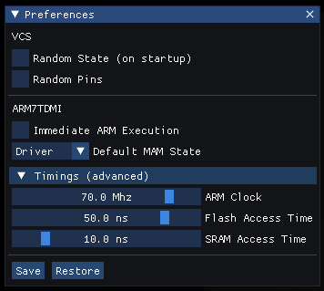 

The characteristics of the ARM processor can be changed via the preferences
window.

In playmode the preferences window can by opened by pressing `F10`. Select the
`ARM` tab:

`Immediate ARM Execution` instructs the emulation to execute the Thumb program
instantaneously without any cycle counting. For performance reasons, you may
want to have this selected but for development work you should leave it
disabled.

If immediate mode is disabled then the `Default MAM State` can be selected.
This is best kept set to the default, `Driver`. This means that the emulated
drivers for the ARM using cartridge type set the MAM appropriately. If
required, this can be changed to `Disabled`, `Partial` or `Full`.

The `Abort on Illegal Memory Access` option controls what happens when the
custom Thumb program tries to read or write to memory that doesn't exist. If
the option is on then the Thumb program will exit early and the 6502 program
(ie. normal console operation) will continue.

Note that if the memory access is an instruction fetch the program will always
exit early regardless of this option's setting - there's nothing meaningful
that can be done if the PC value is out of range.

Details of illegal memory accesses are always written to the log, regardless of
the `Abort on Illegal Memory Access` option.
 

### ARM Disassembly

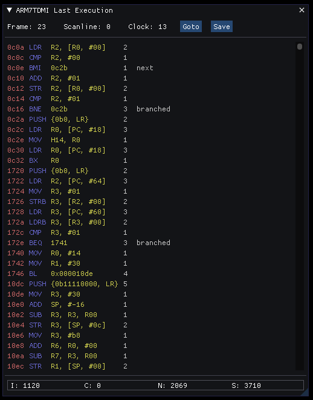 

The `Gopher2600` debugger provides a `dissasembly` window for ARM programs. By
default disassembly is turned off for performance reasons.

Note that when the ARM emulation is run in `immediate mode`, the cycles column
will not contain any meaningful information.
 

### Estimation of ARM Execution Time (Cycle Counting)

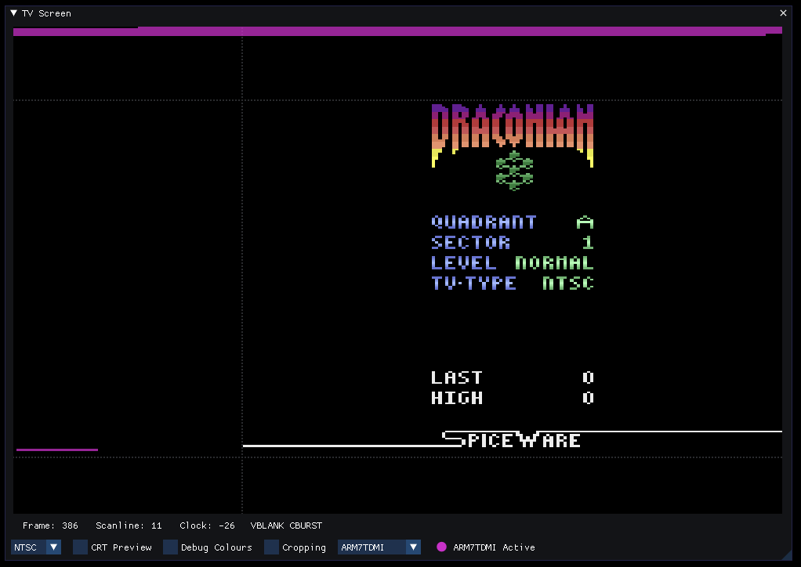 

For ARM development the `ARM7TDMI` overlay is provided. This overlay will be
empty if the `Immediate ARM Execution` option is enabled but normally it will
indicate the period the ARM program is running and the 6507 program is stalled.

Also note that for best results the `cropping` option (see screenshot) should be disabled.

This view is useful during development to make sure you ARM program isn't running for too long.
 

## Movie Cart

`Movie Cart` is a new cartridge type specifically aimed at playing full length
movies on the Atari VCS. The reference code and circuit board information can
be found on Github: https://github.com/lodefmode/moviecart.

`Gopher2600` allows Movie Cart files to be played just like any other ROM.
Files must have the '.mvc' file extension and can only be streamed from the a
local filing system. Streaming over HTTP will be supported in the future.

## Recording Gameplay

`Gopher2600` can record all user input and playback for future viewing. This is a very efficient way
of recording gameplay and results in far smaller files than a video recording. It also has other uses,
not least for the recording of complex tests for the regression database.

To record a gameplay session, use the `record` flag. Note that we have to specify the `run` mode for the
flag to be recognised:

	> gopher2600 run -record roms/Pitfall.bin
	
This will result in a recording file in your current working directory, with a name something like:

	> recording_Pitfall_20200201_093658
	
To playback a recording, simply specify the recording file instead of a ROM file:

	> gopher2600 recording_Pitfall_20200201_093658

## Regression Database

#### Adding

To help with the development process a regression testing system was added. This will prove
useful during further development. To quickly add a ROM to the database:

	> gopher2600 regress add roms/Pitfall.bin

By default, this adds a "video digest" of the first 10 frames of the named ROM. We can alter the
number of frames, and also other parameters with `regress add` mode flags. For example, to run for
100 frames instead of 10:

	> gopher2600 regress add -frames 100 roms/Pitfall.bin

The database also supports the adding of playback files. When the test is run, the playback file
is run as normal and success measured. To add a playback to the test data, simply specify the playback
file instead of a rom:

	> gopher2600 regress add recording_Pitfall_20200201_093658

Consult the output of `gopher2600 regress add -help` for other options.

#### Listing

To listing all previously add tests use the "list" sub-mode:

	> gopher2600 regress list
	> 000 [video] player_switching [AUTO] frames=10  [NUSIZ]
	> 001 [video] NUSIZTest [AUTO] frames=10  [NUSIZ]
	> 002 [video] testSize2Copies_A [AUTO] frames=10  [NUSIZ]
	> 003 [video] testSize2Copies_B [AUTO] frames=10  [NUSIZ]
	> 004 [video] player8 [AUTO] frames=10  [NUSIZ]
	> 005 [video] player16 [AUTO] frames=10  [NUSIZ]
	> 006 [video] player32 [AUTO] frames=10  [NUSIZ]
	> 007 [video] barber [AUTO] frames=10  [NUSIZ]
	> 008 [video] test1.bas [AUTO] frames=10  [TIMER]
	> 009 [video] test2.bas [AUTO] frames=10  [TIMER]
	> 010 [video] test3.bas [AUTO] frames=10  [TIMER]
	> 011 [video] test4.bas [AUTO] frames=10  [TIMER]
	> Total: 12

#### Running

To run all tests, use the `run` sub-mode:

	> gopher2600 regress run

To run specific tests, list the test numbers (as seen in the list command result)
on the command line. For example:

	> gopher2600 regress run 1 3 5
	
An interrupt signal (ctrl-c) will skip the current test. Two interrupt signals
within a quarter of a second will stop the regression run completely.

#### Deleting

Delete tests with the `delete` sub-mode. For example:

	> gopher2600 regress delete 3

## ROM Setup

The setup system is currently available only to those willing to edit the "database" system by hand.
The database is called `setupDB` and is located in the project's configuration directory. The format
of the database is described in the setup package. Here is the direct link to the source
level documentation: https://godoc.org/github.com/JetSetIlly/Gopher2600/setup

This area of the emulation will be expanded upon in the future.

## Supported Cartridge Formats

`Gopher2600` currently supports the following formats:

* Atari 2k/4k/16/32k
* all of the above with the `superchip`
* CBS (FA)
* Tigervision (3F)
* Parker Bros (E0)
* M-Network (E7)
* DPC
* Superbank

In also supports the [Supercharger](#supercharger-roms) format in both the `.bin` format and is also able to load from an `MP3` recording of the supercharger tape.

Modern formats supported:

* 3E
* 3E+
* DF
* DPC+
* CDF (including CDFJ and CDFJ+)

The last two formats often make use of the `ARM7TDMI` coprocessor as found in
the `Harmony` cartridge and are fully supported by `Gopher2600`.

Missing Formats:

* X07. This was only ever used as far as I know, with `Stella's Stocking` which has never been released (ROM dumped).

## Statistics Viewer

Playmode and debug mode can both be launched with a statistics viewer available
locally on your machine `localhost:12600/debug/statsview`.

	> gopher2600 -statsview <rom>
	
	> gopher2600 debug -statsview <rom>

The screen below shows an example of the featured statistics. In this
instance, this is the debugger running a 4k Atari cartridge (specifically,
Pitfall).

	 

For people who really want to dig deep into the running program,
`localhost:12600/debug/pprof/` gives more raw, but still useful
information.

Note that this feature requires you run a suitably [compiled](#compilation) executable. The easiest
way to do this is to use the Makefile.

	> make release_statsview

## Gopher2600 Tools

See the https://github.com/JetSetIlly/Gopher2600-Utils/ repository for examples of tools
that use `Gopher2600`.

## Resources used

The Stella project (https://stella-emu.github.io/) was used as a reference for
video output. In the absence of VCS hardware (which I don't have) Stella was
the only option I had for checking video accuracy.

No reference to the Stella source was made at all except for the following:

* During the development of the CDF cartridge formats. These recent formats don't
seem to be documented anywhere accept in the Stella source.

* ParkerBros fingerprint taken from Stella. I can't remember why I did this but
a comment in the fingerprint.go file says I did.

* As a reference for the audio implementation (the 6502.ts project was also
  referenced for this reason)

Many notes and clues from the AtariAge message boards. Most significantly the
following threads proved very useful indeed:

* "Cosmic Ark Star Field Revisited"
* "Properly model NUSIZ during player decode and draw"
* "Requesting help in improving TIA emulation in Stella" 
* "3F Bankswitching"
* "TIA Sounding Off in the Digital Domain"

And from and old mailing list:

* "Games that do bad things to HMOVE..." https://www.biglist.com/lists/stella/archives/199804/msg00198.html

These mailing lists and forums have supplied me with many useful test ROMs. I
will package these up and distribute them sometime in the future (assuming I
can get the required permissions).

Extensive references have been made to Andrew Towers' "Atari 2600 TIA Hardware
Notes v1.0"

Cartridge format information was found in Kevin Horton's "Cart Information
v6.0" file (sometimes named bankswitch_sizes.txt)

The "Stella Programmer's Guide" by Steve Wright is of course a key document,
used frequently throughout development.

The TIA Audio implementation is based almost entirely on the work of Chris Brenner.

https://atariage.com/forums/topic/249865-tia-sounding-off-in-the-digital-domain/

Musical information as seen in the tracker window taken from Random Terrain.

https://www.randomterrain.com/atari-2600-memories-music-and-sound.html

The 6507 information was taken from Leventhal's "6502 Assembly Language
Programming" and the text file "64doc.txt" v1.0, by John West and Marko Makela.

US Patent Number 4,644,495 was referenced for the implementation of the DPC cartridge format
(the format used in Pitfall 2)

DPC+ format implemented according to notes provided by Spiceware https://atariage.com/forums/topic/163495-harmony-dpc-programming
and

https://atariage.com/forums/blogs/entry/11811-dpcarm-part-6-dpc-cartridge-layout/

DPC+ARM information on Spiceware's blog

https://atariage.com/forums/blogs/entry/11712-dpc-arm-development/?tab=comments#comment-27116

The "Mostly Inclusive Atari 2600 Mapper / Selected Hardware Document" (dated 03/04/12) by Kevin Horton

Supercharger information from the Kevin Horton document above and also the `sctech.txt` document

Reference for the ARM7TDMI-S, as used in the Harmony cartridge formats:

https://developer.arm.com/documentation/ddi0234/b

For detail about the Thumb instruction set the following document was
preferred. Mnemonics used in the ARM disassembly are from this document:

http://bear.ces.cwru.edu/eecs_382/ARM7-TDMI-manual-pt1.pdf

Further information from the ARM Architecture Reference Manual:

http://www.ecs.csun.edu/~smirzaei/docs/ece425/arm7tdmi_instruction_set_reference.pdf

https://www.cs.miami.edu/home/burt/learning/Csc521.141/Documents/arm_arm.pdf

Specific information about UXP ARM7TDMI-S 

https://www.nxp.com/docs/en/user-guide/UM10161.pdf

## Further Help

In addition to this readme, more information can be found with the command line `-help` system.
Many modes and sub-modes will accept operational flags. Specifying the `-help` flag will print
a brief summary of available options.

Help on debugger commands is available with the `HELP` command at the debugger command line.

More information is available in the Go source files and can be viewed with the
Go documentation system. With `godoc` installed:

	> GOMOD=$(pwd) godoc -http=localhost:1234 -index >/dev/null &

Alternatively, the most current version of the docs available on github can be viewed 
at https://godoc.org/github.com/JetSetIlly/Gopher2600

Finally, development and maintenance documentation is beginning to be stored in its
own Github repository: https://github.com/JetSetIlly/Gopher2600-Dev-Docs

## Self Reflection

There are some design decisions that would perhaps be made differently if I had
known where the program was going. For instance, because the project was a way
of learning a new programming language I chose to implement my own "database"
to [store regression test information](#regression-database). A more natural
choice would be to use SQlite but actually the current solution works quite
well.

A couple of packages may well be useful in other projects. The `prefs` package
is quite versatile. With a bit of work it could be generalised and put to use
in other projects. I think though, this package is a natural candidate to be
rewritten with type parameters. Not yet available in Go but scheduled for
release in 2022.

I would also replace the `commandline` package. It works quite nicely but as
you would expect from a home-baked solution there are limitations to the
parser. It should be rewritten with `flex` & `yacc`.

## Other Software / Libraries

The following projects are used in the `Gopher2600` project:

* https://github.com/ocornut/imgui
* https://github.com/inkyblackness/imgui-go
* https://github.com/veandco/go-sdl2
* https://github.com/go-gl/gl
* https://github.com/go-audio/audio
* https://github.com/go-audio/wav
* https://github.com/hajimehoshi/go-mp3
* https://github.com/pkg/term

Bother 6502.ts and Stella were used as reference for the Audio implementation.

Statsview provided by:

* https://github.com/go-echarts/statsview

For testing instrumentation:

* https://github.com/bradleyjkemp/memviz

Some ideas for the fragment shader taken from:

* https://github.com/libretro/glsl-shaders/blob/master/crt/shaders/crt-pi.glsl
* https://www.shadertoy.com/view/ltB3zD
* https://github.com/mattiasgustavsson/crtview

