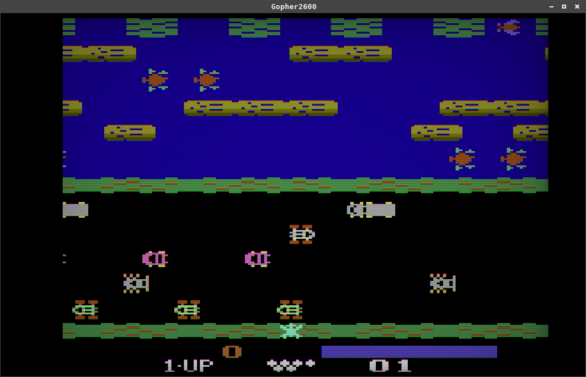
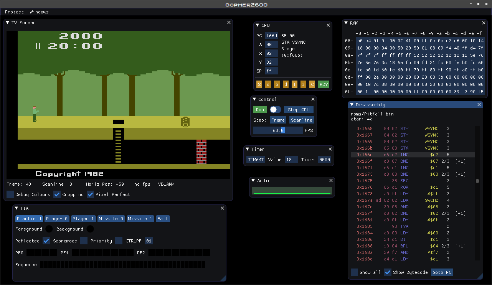
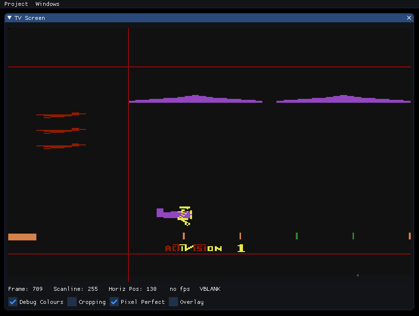
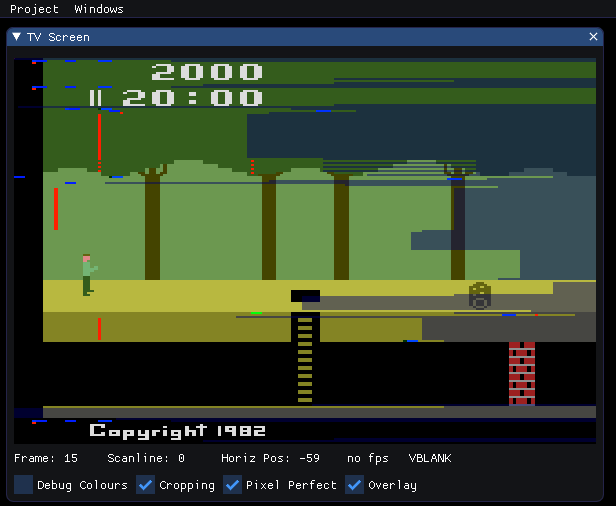
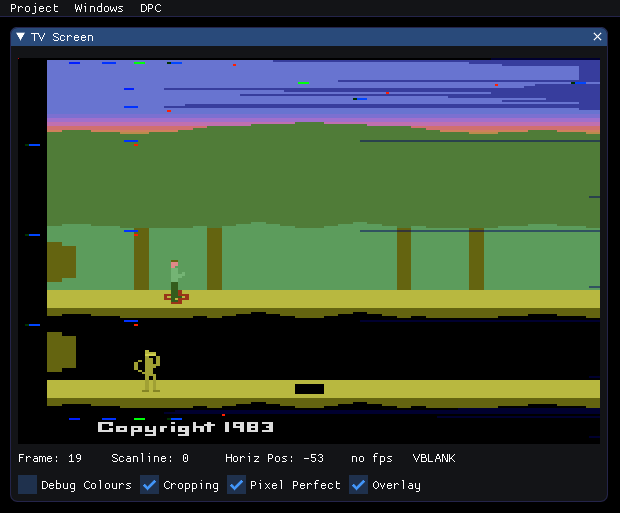

# Gopher2600

Gopher2600 is an emulator for the Atari 2600. Whilst the performance is not as efficient as some other emulators it is none-the-less suitable for playing games, on a reasonably modern computer, at the required 60fps. (The development machine for Gopher2600 has been an i3-3225, dating from around 2012.)

The accuracy of the emulation is very high although this is difficult to prove. Certainly, there are no known outstanding issues in the TIA or RIOT.

The 6507 emulation is also very accurate although, at the time of writing, not all undocumentated opcodes are implemented. That said, the emulation method used for the CPU means adding a missing opcode is trivial.

The emulator also comes with a powerful graphical debugger. This is still in active development with many planned additional features but currently it features:

* CPU and Video stepping
* Breakpoints, traps, watches on various CPU, TIA, RIOT targets
* Interactive TV Screen
* Specialist windows for specific cartridge types (eg. Supercharger)
* Script recording and playback
* Line terminal interface for harder to reach parts of the emulation

In addition to the debugger, `Gopher2600` can record and playback gameplay sessions. This powerful feature efficiently records user input to a text file, suitable for passing along to other people for viewing.

The gameplay playback feature is also used in the inbuilt "regression database". This database allow for easy testing of the emulator's integrity and was of invaluable use during development of the emulator. This feature will also be of use perhaps when developing new ROMs for the Atari 2600 - a way of recording the ideal output of the ROM for future comparison.

The Atari 2600 comes with a variety of hand controllers and `Gopher2600` does it's very best to automatically select the correct input device. This is an feature that will be expanded on greatly in the future but currently joysticks, paddles and keyboard are all supported.

`Gopher2600` is in active development and feature requests are welcomed.

## Screenshots

A variety of screenshots from various points in the emulator's development.

   

The following screenshot shows the fabled `ET` ROM. In this case the ROM has been patched to fix some notorious issues with the original game. Notice, the colour of ET and how he is standing in front of the pit? The patches in question were taken from http://www.neocomputer.org/projects/et/ and automatically applied. Auto-patching of ROMs is a feature of the emulator

The next three images show the "TV screen" of the graphical debugger in various states. In the first screenshot, we see `Barnstormer` with the "debug colours" turned on. This idea was taken from the Stella emulator and indeed, these are the same colours used in that emulator. Unlike Stella however, we can also see the off-screen areas of the tv image, and in particular, the sprites as they "appear" off-screen. 

The next two screenshots show the `Gopher2600's` overlay feature. An overlay is a way of adding information to the TV screen with the aim of helping the debugging process.

The first screenshot shows the `WSYNC` overlay. This overlay shows us graphically the scanlines on which WSYNC has been triggered. In Atari 2600 programming terms, the WSYNC is a way of synchronising the CPU with the TIA. The downside of the WSYNC is that CPU cycles are wasted - something that is not always obvious when looking at the ROM's assembly.

The second screenshot shows 'Pitfall 2' and we can see straight away that fewer CPU cycles are wasted, simply by the shorter and less frequent blue bars extending to the right of the screen.

  

## Resources used

The Stella project (https://stella-emu.github.io/) was used as a reference for
video output. I made the decision not to use or even to look at any of Stella's
implementation details. The exception to this was a peek at the audio
sub-system. Primarily however, Gopher2600's audio implementation references Ron
Fries' original TIASound.c file.

Many notes and clues from the AtariAge message boards. Most significantly the
following threads proved very useful indeed:

* "Cosmic Ark Star Field Revisited"
* "Properly model NUSIZ during player decode and draw"
* "Requesting help in improving TIA emulation in Stella" 
* "3F Bankswitching"

And from and old mailing list:

* "Games that do bad things to HMOVE..." https://www.biglist.com/lists/stella/archives/199804/msg00198.html

These mailing lists and forums have supplied me with many useful test ROMs. I
will package these up and distribute them sometime in the future (assuming I
can get the required permissions).

Extensive references have been made to Andrew Towers' "Atari 2600 TIA Hardware
Notes v1.0"

Cartridge format information was found in Kevin Horton's "Cart Information
v6.0" file (sometimes named bankswitch_sizes.txt)

The "Stella Programmer's Guide" by Steve Wright is of course a key document,
used frequently throughout development.

The 6507 information was taken from Leventhal's "6502 Assembly Language
Programming" and the text file "64doc.txt" v1.0, by John West and Marko Makela.

US Patent Number 4,644,495 was referenced for the implementation of the DPC cartridge format
(the format used in Pitfall 2)

DPC+ format implemented according to notes provided by Spiceware https://atariage.com/forums/topic/163495-harmony-dpc-programming

The "Mostly Inclusive Atari 2600 Mapper / Selected Hardware Document" (dated 03/04/12) by Kevin Horton

Supercharger information from the Kevin Horton document above and also the `sctech.txt` document

## ROMs used during development

A variety of ROMs were used throughout development and compared with the
Stella emulator for accuracy.

## Compilation

The project has most recently been tested with Go v1.14. It will not work with
versions earlier than v1.13 because of language features added in that version
(binary literals).

The project uses the Go module system and dependencies will be resolved
automatically. Do note however, that you will also require the SDL development
kit installed on the system. For users of UNIX like systems, installation from
your package manager is the easiest option (for MacOS use the homebrew package
manager https://formulae.brew.sh/formula/sdl2)

Compile with GNU Make

	> make release

During development, programmers may find it more useful to use the go command
directly

	> go run gopher2600.go

## Cross-Compilation

Native compilation of a Windows executable has not yet been tried. But
cross-compilation does work via the Makefile:

	> make cross_windows

Or for a statically linked binary:
	
	> make cross_windows_static

This has been tested on a Linux system with mingw installed.

## Basic usage

Once compiled run the executable with the help flag:

	> gopher2600 -help

This will list the available sub-modes. USe the -help flag to get information
about a sub-mode. For example:

	> gopher2600 debug -help

To run a cartridge, you don't need to specify a sub-mode. For example:

	> gopher2600 roms/Pitfall.bin

Although if want to pass flags to the run mode you'll need to specify it.

	> gopher2600 run -help

## Hand Controllers

Joystick, paddle and keypad inputs are supported. Currently, only joysticks and paddles for the left player are available however. 

The joystick is operated via the cursor keys on the keyboard and the spacebar in place of the fire button.

The paddle is available by operating the mouse. To activate the paddle, click
in the play window and waggle the mouse to the extremes three times. Note that
once the window has been clicked, the mouse will be captured and the pointer
will disappear. To "release" the mouse, click the right-mouse button.

Keypad input is available only when the emulation thinks it is required. When keypad input is expected, neither joystick or paddle controls will work.

#### Joystick (left player)

* Cursor keys for stick direction
* Space bar for fire

#### Joystick (right player)

Not yet emulated

#### Paddle (left player)

* Left mouse button in window to capture mouse (waggle mouse to activate paddle)
* Mouse left/right motion for paddle motion 
* Left mouse button for paddle's fire button
* Right mouse button to leave "paddle mode"

#### Paddle (right player)

Not yet emulated

#### Keypad

Keypads for both player 0 and player 1 are supported. 

|   |p0|   |   |p1|   |
|:-:|:-:|:-:|:-:|:-:|:-:|
| 1 | 2 | 3 | 4 | 5 | 6 |		
| q | w | e | r | t | y |		
| a | s | d | f | g | h |		
| z | x | c | v | b | n |

#### Panel

The VCS panel is controlled through the function keys of the keyboard.

* F1 Panel Select
* F2 Panel Reset
* F3 Color Toggle
* F4 Player 0 Pro Toggle
* F5 Player 0 Pro Toggle

## Debugger

To run the debugger use the DEBUG submode

	> gopher2600 debug roms/Pitfall.bin

The default debugging mode display a windowed interface. A thorough explanation of the interface is not yet available but it is should be self-explanatory. Note that the ROM can be "played" by clicking on the screen image in  the `TV Screen` window. This will "capture" the mouse and allow the emulated VCS to be interacted with in the normal way. Click the right mouse button to release the captured mouse.

In addition to the controller and panel input described above, the following keys are also available during mouse capture:

* F12 (backtick) Toggle screen masking
* F11 Toggle debugging colors
* F10 Toggle debugging overlay
* \+ Increase screen size
* \- Decrease screen size

#### Debugger Terminal

As an alternative to GUI interaction the debugger can also be controlled through a terminal. This is available through the `terminal` window. The rest of this section describesthe operation of the terminal in detail.

Help is available with the HELP command. Help on a specific topic is available
by specifying a keyword. The list below shows the currently defined keywords.
The rest of the section will give a brief run down of debugger features.

	[ $f000 SEI ] >> help
			 AUDIO          BALL         BREAK     CARTRIDGE         CLEAR
		    CONTROLLER           CPU   DISASSEMBLY       DISPLAY          DROP
			  GREP          HALT          HELP        INSERT      JOYSTICK
			KEYPAD          LAST          LINT          LIST           LOG
			MEMMAP       MISSILE        ONHALT        ONSTEP       ONTRACE
			 PANEL         PATCH          PEEK        PLAYER     PLAYFIELD
			  POKE          PREF       QUANTUM          QUIT           RAM
			 RESET           RUN        SCRIPT          STEP        SYMBOL
			   TIA

The debugger allows tab-completion in most situations. For example, pressing `W` followed by the Tab key on your keyboard, will autocomplete the `WATCH` command. This works for command arguments too. It does not currently work for filenames, or symbols. Given a choice of completions, the Tab key will cycle through the available options.

Addresses can be specified by decimal or hexadecimal. Hexadecimal addresses can be writted `0x80` or `$80`. The debugger will echo addresses in the first format. Addresses can also be specified by symbol if one is available. The debugger understands the canonical symbol names used in VCS development. For example, `WATCH NUSIZ0` will halt execution whenever address 0x04 (or any of its mirrors) is written to. 

Watches are one of the three facilities that will halt execution of the emulator. The other two are `TRAP` and `BREAK`. Both of these commands will halt execution when a "target" changes or meets some condition. An example of a target is the Programmer Counter or the Scanline value. See `HELP BREAK` and `HELP TRAP` for more information.

Whenever the emulation does halt, the `ONHALT` command will run. For example, a previous call to `ONHALT CPU` will cause the `CPU` command to run whenever the emulation stops. Similarly, the `ONSTEP` command applies whenever the emulation is stepped forward. By default, the `LAST` command is run on every step.

The debugger can step forward either, one CPU instruction at a time, or by one video cycle at a time. We can change this mode with the `QUANTUM` command. We can also conveniently use the `STEP` command, for example `STEP VIDEO`, performing the quantum change and stepping forward in one go. The `STEP` command can also be used to run until the next time a target changes. For example, `STEP SCANLINE`. Using `STEP` in this way is often more useful than setting up a `TRAP`.

Scripts can be recorded and played back with the `SCRIPT` command. All commands are available when in script recording mode, except `RUN` and further `SCRIPT RECORD` command. Playing back a script while recording a new script is possible.

## Configuration Directory

Gopher2600 will look for certain files in a configuration directory. The location
of this directory depends on whether the executable is a release executable (built
with "make release") or a development executable (made with "make build"). For
development executables the configuration directory is named `.gopher2600` and is 
located in the current working directory.

For release executables, the directory is placed in the user's configuration directory,
the location of which is dependent on the host OS. On modern Linux systems, the location
is `.config/gopher2600`.

For MacOS the directory for release executables is `~/Library/Application Support/gopher2600`

For Window, files will be in the user's `Application Data/gopher2600` folder

In all instances, the directory, sub-directory and files will be created automatically
as required.

### Supercharger ROMs

Supercharger ROMs require the presence of the supercharger BIOS in the
configuration directory. It should be named `Supercharger BIOS.bin`.

## Recording Gameplay

Gopher2600 can record all user input and playback for future viewing. This is a very efficient way
of recording gameplay and results in far smaller files than a video recording. It also has other uses,
not least for the recording of complex tests for the regression database.

To record a gameplay session, use the `record` flag. Note that we have to specify the `run` mode for the
flag to be recognised:

	> gopher2600 run -record roms/Pitfall.bin
	
This will result in a recording file in your current working directory, with a name something like:

	> recording_Pitfall_20200201_093658
	
To playback a recording, simply specify the recording file instead of a ROM file:

	> gopher2600 recording_Pitfall_20200201_093658

## Regression Database

#### Adding

To help with the development process a regression testing system was added. This will prove
useful during further development. To quickly add a ROM to the database:

	> gopher2600 regress add roms/Pitfall.bin

By default, this adds a "screen digest" of the first 10 frames of the named ROM. We can alter the
number of frames, and also other parameters with `regress add` mode flags. For example, to run for
100 frames instead of 10:

	> gopher2600 regress add -frames 100 roms/Pitfall.bin

The database also supports the adding of playback files. When the test is run, the playback file
is run as normal and success measured. To add a playback to the test data, simply specify the playback
file instead of a rom:

	> gopher2600 regress add recording_Pitfall_20200201_093658

#### Listing

To listing all previously add tests use the "list" sub-mode:

	> gopher2600 regress list
	> 000 [digest/video] player_switching [AUTO] frames=10  [NUSIZ]
	> 001 [digest/video] NUSIZTest [AUTO] frames=10  [NUSIZ]
	> 002 [digest/video] testSize2Copies_A [AUTO] frames=10  [NUSIZ]
	> 003 [digest/video] testSize2Copies_B [AUTO] frames=10  [NUSIZ]
	> 004 [digest/video] player8 [AUTO] frames=10  [NUSIZ]
	> 005 [digest/video] player16 [AUTO] frames=10  [NUSIZ]
	> 006 [digest/video] player32 [AUTO] frames=10  [NUSIZ]
	> 007 [digest/video] barber [AUTO] frames=10  [NUSIZ]
	> 008 [digest/video] test1.bas [AUTO] frames=10  [TIMER]
	> 009 [digest/video] test2.bas [AUTO] frames=10  [TIMER]
	> 010 [playback] playback_player_20200127_172838 [HMOVE/BAD THINGS]
	> Total: 11

#### Running

To run all tests, use the `run` sub-mode:

	> gopher2600 regress run

To run specific tests, list the test numbers (as seen in the list command result)
on the command line. For example:

	> gopher2600 regress run 1 3 5

#### Deleting

Delete tests with the `delete` sub-mode. For example:

	> gopher2600 regress delete 3

## ROM Setup

The setup system is currently available only to those willing to edit the "database" system by hand.
The database is called `setupDB` and is located in the project's configuration directory. The format
of the database is described in the setup package. Here is the direct link to the source
level documentation: https://godoc.org/github.com/JetSetIlly/Gopher2600/setup

## Gopher2600 Tools

See the https://github.com/JetSetIlly/Gopher2600-Utils/ repository for examples of tools
that use `Gopher2600`.

## Futher Help

In addition to this readme, more information can be found with the command line `-help` system.
Many modes and sub-modes will accept operational flags. Specifying the `-help` flag will print
a brief summary of available options.

Help on debugger commands is available with the `HELP` command at the debugger command line.

More information is available in the Go source files and can be viewed with the
Go documenation system. With `godoc` installed:

	> GOMOD=$(pwd) godoc -http=localhost:1234 -index >/dev/null &

Alternatively, the most current version of the docs available on github can be viewed 
at https://godoc.org/github.com/JetSetIlly/Gopher2600

Finally, development and maintenance documentation is beginning to be stored in its
own Github repository: https://github.com/JetSetIlly/Gopher2600-Dev-Docs

## Other Software / Libraries

The following projects are used in the gopher2600 project.

* https://github.com/ocornut/imgui
* https://github.com/inkyblackness/imgui-go
* https://github.com/veandco/go-sdl2
* https://github.com/go-gl/gl
* https://github.com/go-audio/audio
* https://github.com/go-audio/wav
* https://github.com/pkg/term
