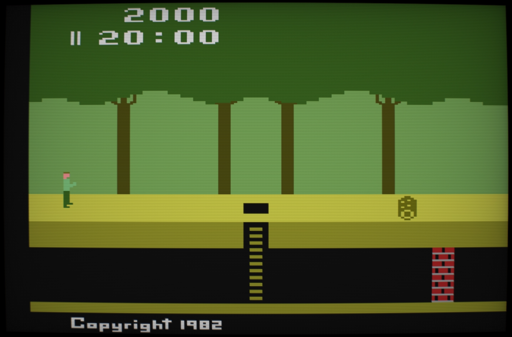
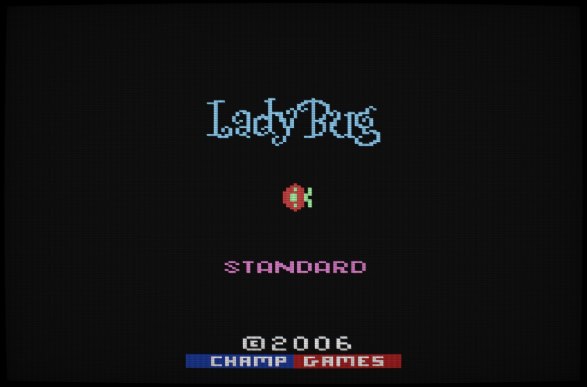
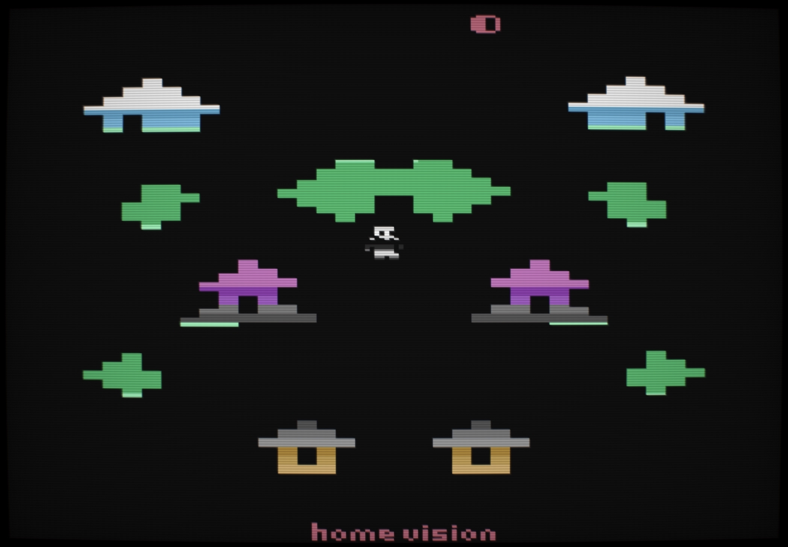
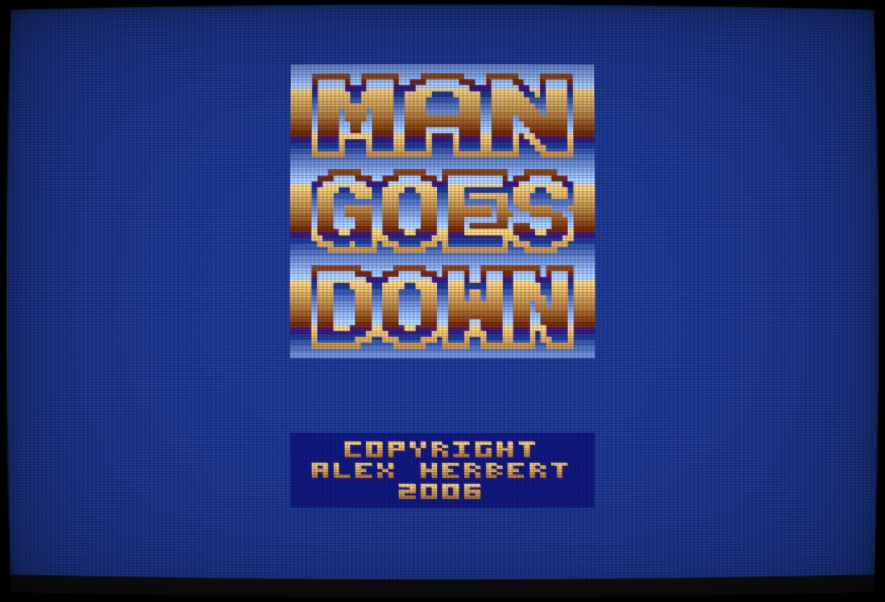
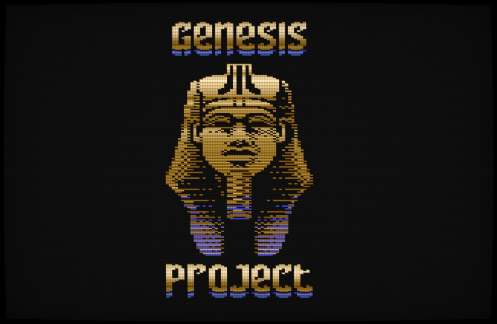

# Gopher2600

`Gopher2600` is an emulator for the Atari 2600 written in the Go language. The accuracy of the emulation is very high and the 6507, TIA and RIOT chips are well represented. The key features of the emulator:

* [Support for many of the known cartridge formats](#supported-cartridge-formats)
* [Gameplay recording and playback](#recording-gameplay)
* Support for (and auto-detection of) [keypad,paddle and joystick](#hand-controllers)
* Network access through [PlusROM](#plusrom) emulation
* [Savekey](#savekey) support
* Rudimentary [CRT Effects](#crt-effects)

The graphical [debugger](#debugger) is still in development but the current features include:

* CPU and Video stepping
* Breakpoints, traps, watches on various CPU, TIA, RIOT targets
* [Interactive rewinding](#rewinding)
* Specialist windows for specific cartridge types (eg. supercharger tape)
* Script recording and playback
* Line [terminal](#debugger-terminal) interface for harder to reach parts of the emulation
* [Regression Database](#regression-database)

## Screenshots

 
 
     

## Scope of the project

`Gopher2600` was started as for fun and educational purposes, as way of
learning more about the `Atari 2600` and also about the
[Go programming language](https://golang.org/).

The original intent was to provide a tool for static analysis of a 6507
program. I soon realised that I would need to emulate more and more of the
2600 and not just the CPU. Eventually, I realised I would also need a way of see the
video output from the TIA. At this point it became obvious that I was indeed
writing a complete 2600 emulator.

Because of its origins, any flaws or limitations in the design should be borne
in mind while the project is still in development. I am open to any suggestions
on how to improve the project.

### Self-reflection

There are some design decisions that would perhaps be made differently if I had
known where the program was going. For instance, because the project was a way
of learning a new programming language I chose to implement my own "database"
to [store regression test information](#regression-database). A more natural
choice would be to use SQlite but actually the current solution works quite
well.

A couple of packages may well be useful in other projects. The `prefs` package
is quite versatile. With a bit of work it could be generalised and put to use
in other projects. I think though, this package is a natural candidate to be
rewritten with type parameters. Not yet available in Go but scheduled for
release in 2022.

I would also replace the `commandline` package. It works quite nicely but as
you would expect from a home-baked solution there are limitations to the
parser. It should be rewritten with `flex` & `yacc`.

### Performance

The development machine for `Gopher2600` was an i3-3225 with 16GB of RAM. Host
operating system throughout the development has been a GNU/Linux system.

In playmode I can get a sustained frame rate of 60fps. However, video output is
not properly vsynced and the audio buffer is not handled very well, sometimes
running out of bits, resulting in pops and stutters in the sound.

In debug mode, I can get around 35fps - good enough for development work.

To get a performance rating for your installation you can run the following:

	> gopher2600 performance -display -fpscap=false

Which gives the maximum frame rate with the display.

Memory usage is around 40MB of system memory in playmode and around 120MB in
debug mode. This can vary on the ROM used however. It shouldn't ever be a
problem on modern hardware.

A `statsview` is also available. See the section below on the [Statistics Viewer](#statistics-viewer) for
details.

## Compilation

The project has most recently been tested with Go v1.15. Earlier versions may work
but v1.15 is recommended due to recent performance improvements.

The project uses the Go module system and dependencies will be resolved
automatically. Do note however, that you will also require the SDL development
kit installed on the system. For users of UNIX like systems, installation from
your package manager is the easiest option (for MacOS use the homebrew package
manager https://formulae.brew.sh/formula/sdl2)

Compile with GNU Make

	> make release

During development, programmers may find it more useful to use the go command
directly

	> go run gopher2600.go
	
### Minimum requirements

`Gopher2600` makes use of SDL2. The SDL2 go binding used by the project requires a minimum
SDL2 version of `2.0.10`.

### Cross-Compilation

Native compilation of a Windows executable has not yet been tried. But
cross-compilation does work via the Makefile:

	> make cross_windows

Or for a statically linked binary:
	
	> make cross_windows_static

This has been tested on a Linux system with mingw installed.

## Basic usage

Once compiled run the executable with the help flag:

	> gopher2600 -help

This will list the available sub-modes. Use the -help flag to get information
about a sub-mode. For example:

	> gopher2600 debug -help

To run a cartridge, you don't need to specify a sub-mode. For example:

	> gopher2600 roms/Pitfall.bin

Although if want to pass flags to the run mode you'll need to specify it.

	> gopher2600 run -help

## Hand Controllers

Joystick, paddle and keypad inputs are supported. Currently, only joysticks and paddles for the left player are available. 

The joystick is operated via the cursor keys on the keyboard and the spacebar in place of the fire button. Gamepad support will be added in the future.

The paddle is available by operating the mouse. To activate the paddle, double-click
the play window and waggle the mouse a few times. Note that once the window
has been double-clicked, the mouse will be captured and the pointer will
disappear. To "release" the mouse, click the right-mouse button or the escape
key.

### Keypad

Keypads for both player 0 and player 1 are supported. 

|   |p0|   |   |p1|   |
|:-:|:-:|:-:|:-:|:-:|:-:|
| 1 | 2 | 3 | 4 | 5 | 6 |		
| q | w | e | r | t | y |		
| a | s | d | f | g | h |		
| z | x | c | v | b | n |

#### Panel

The VCS panel is controlled through the function keys of the keyboard.

* F1 Panel Select
* F2 Panel Reset
* F3 Colour Toggle
* F4 Player 0 Pro Toggle
* F5 Player 0 Pro Toggle

In playmode, the additional keys are available:

* F11 Toggle Fullscreen
* F12 Show FPS Indicator

## Debugger

To run the debugger use the `DEBUG` submode

	> gopher2600 debug roms/Pitfall.bin

Becaus the debugger is still in development, full documentation not yet available. But briefly the features we can see in this screeshot are:

The menu-bar across the top of the screen shows the `Debugger`, `VCS` and in this instance a `Cartridge` menu

* From `Debugger` menu you can open the preferences windows the terminal and others.
* The `VCS` menu contains options to open windows that relate to the VCS itself.
	* Many of them are already open but other, less frequently required windows are also available
* The `Cartridge` menu appears when the loaded cartridge type has additional features. For example:
	* Cartridge memory and or registers
	* In this case, this is the menu for the `Supercharger` format.
* At the very right of the menu bar we can see the file path for the loaded cartridge

Below the menu-bar are the debugging windows. In this screenshot we can see:

* The `TV Screen`. This shows the television output from the VCS.
	* The screen is 'interactive' and will show information about the pixel underneath the cursor
	* Clicking the screen will move the VCS emulation to the point where the VCS is outputting that pixel. This is part of the [rewind](#rewinding) system.
	* Also available are a variety of `overlays`. Click the overlay toggle and select which overlay you want to show by selecting with the button to its right (labelled `WSYNC` in the screenshot).
* The `Audio` window shows the waveform of the recent sound output.
* The `Control` window allow you to `Run/Halt`, `Step` and also `rewind` through the emulation.
	* The toggle to right of the `Run` button will put the emulation into `video-cycle` mode. This will allow you to step by a single color-clock at a time, rather than a single CPU instruction.
* The `Timer` window shows the current state of the RIOT Timer.
* The `CPU` window shows the current state of the 6507.
* The `Disassembly` window shows the disassembled ROM.
	* If a 'DASM' generated symbol file is available then that will be used.
	* If a symbols file isn't available then the standard symbols will be used. This includes symbols for special cartridge areas that might exists. For example, a hotspot address for switching banks will be indicated with `BANK1`, `BANK2`, etc. instead of the address.
	* If the cartridge does contain more than one bank then the banks will be viewable by selecting the relevant tab. In the screenshot above, the cartridge contains four banks.
	* Add or remove a `PC Breakpoint` by clicking on the disasm entry.
* The `RAM` window shows the contents of the VCS RAM. Cartidge RAM if available will be show in the `Cartridge RAM` window. Not shown but available through the cartridge menu when appropriate.
	* The highlighted bytes indicate those bytes that have changed since the emulation last halted.	
* The `TIA` window details the six graphical parts of the VCS's graphics chip.
	* The state of the `TIA` can be changed manually but note that the changes will not be retained when the emulation next updates that part of the TIA. This will likely change in future versions of the program.

Note that much of the information presented in the windows is editable in-place. For example, the contents of the CPU's PC register can be edited via the window. As in all areas of this project, the user is encouraged to experiement.

#### Debugger Terminal

As an alternative to GUI interaction the debugger can also be controlled through a terminal. This is available through the `terminal` window. The rest of this section describes the operation of the terminal in detail.

Help is available with the HELP command. Help on a specific topic is available
by specifying a keyword. The list below shows the currently defined keywords.
The rest of the section will give a brief run down of debugger features.

	[ $f000 SEI ] >> help
	         AUDIO          BALL         BREAK     CARTRIDGE         CLEAR
	    CONTROLLER           CPU   DISASSEMBLY       DISPLAY          DROP
	          GREP          HALT          HELP        INSERT      KEYBOARD
	          LAST          LINT          LIST           LOG        MEMMAP
	      MEMUSAGE       MISSILE        ONHALT        ONSTEP       ONTRACE
	         PANEL         PATCH          PEEK        PLAYER     PLAYFIELD
	       PLUSROM          POKE         PREFS       QUANTUM          QUIT
	           RAM         RESET        REWIND          RIOT           RUN
	        SCRIPT          STEP         STICK        SYMBOL           TIA
	         TRACE          TRAP            TV         WATCH

The debugger allows tab-completion in most situations. For example, pressing `W` followed by the Tab key on your keyboard, will autocomplete the `WATCH` command. This works for command arguments too. It does not currently work for filenames, or symbols. Given a choice of completions, the Tab key will cycle through the available options.

Addresses can be specified by decimal or hexadecimal. Hexadecimal addresses can be written `0x80` or `$80`. The debugger will echo addresses in the first format. Addresses can also be specified by symbol if one is available. The debugger understands the canonical symbol names used in VCS development. For example, `WATCH NUSIZ0` will halt execution whenever address 0x04 (or any of its mirrors) is written to. 

Watches are one of the three facilities that will halt execution of the emulator. The other two are `TRAP` and `BREAK`. Both of these commands will halt execution when a "target" changes or meets some condition. An example of a target is the Programmer Counter or the Scanline value. See `HELP BREAK` and `HELP TRAP` for more information.

Whenever the emulation does halt, the `ONHALT` command will run. For example, a previous call to `ONHALT CPU` will cause the `CPU` command to run whenever the emulation stops. Similarly, the `ONSTEP` command applies whenever the emulation is stepped forward. By default, the `LAST` command is run on every step.

The debugger can step forward either, one CPU instruction at a time, or by one video cycle at a time. We can change this mode with the `QUANTUM` command. We can also conveniently use the `STEP` command, for example `STEP VIDEO`, performing the quantum change and stepping forward in one go. The `STEP` command can also be used to run until the next time a target changes. For example, `STEP SCANLINE`. Using `STEP` in this way is often more useful than setting up a `TRAP`.

Scripts can be recorded and played back with the `SCRIPT` command. All commands are available when in script recording mode, except `RUN` and further `SCRIPT RECORD` command. Playing back a script while recording a new script is possible.

#### Rewinding

`Gopher2600` allows emulation state to be rewound to an earlier frame, scanline
or colour-clock. Rewinding by frame is best done through the `Control` window of
the debugger. 

The slider can be scrolled to any frame between the two limits indicated.
Alternatively, a single frame can be stepped back and forward using the arrow
buttons.

Rewinding to a scanline/colour-clock is done by clicking the left mouse button
on the debug screen, at the position required. This will change the state of
the emulation accordingly. This can be done with any frame in the rewind
history without damaging the rewind history.

The rewind history will be cropped and continue from the current point whenever
the emulation is run or stepped.

The number of rewind states stored can be set via the preferences window (or
through the terminal). In addition the snapshot frequency can also be altered.
The frequency defines how many frames must pass before another snapshot is
taken. This affects the number of frames that can be stored. For example, if
number of states is 100 and frequency is 1 then one-hundred frames can be
stored in the rewind history. On the other hand, if the number of states is 100
and frequency is 5 then five-hundred frames can be stored.

The rewind frequency does not affect the granularity of the rewind history.
This means that you can rewind to any frame in the rewind history even if no no
explicit snapshot has been taken.

The downside of large frequencies is that input events (from a joystick for
example) may be lost if they occurred between snapshots. Future versions of
`Gopher2600` will correct this.

Rewind is also not currently available in playmode. Again, future version of
`Gopher2600` will allow this.

Video quantum is also not fully supported. While the rewind system will work
when in video-stepping mode you can not currently interactively alter the
screen position to the level of an individual colour-clock. Left-clicking on the
screen, as described above, will 'quantise' to the next CPU instruction. Future
versions of `Gopher2600` will correct this.

## CRT Effects

`Gopher2600` offers basic emulation of a CRT television. This is by no means
complete and is an area of active development.

By default `playmode` enables CRT effects. You can turn them off with a
commandline switch:

	> gopher2600 -crt=false roms/Pitfall.bin

Individual CRT effects can be turned on and off but currently you need to enter
debug mode for this. Select the `CRT Preferences` entry in the `Debugger` menu.
The following window will be shown:

For reasonably modern GFX card (the developer has a GeForce GTX 650) none of
these effects should have any impact on performance, so the effect strength (or whether
they are enabled at all) is down to taste.

## Configuration Directory

`Gopher2600` will look for certain files in a configuration directory. The location
of this directory depends on whether the executable is a release executable (built
with "make release") or a development executable (made with "make build"). For
development executables the configuration directory is named `.gopher2600` and is 
located in the current working directory.

For release executables, the directory is placed in the user's configuration directory,
the location of which is dependent on the host OS. On modern Linux systems, the location
is `.config/gopher2600`.

For MacOS the directory for release executables is `~/Library/Application Support/gopher2600`

For Windows, a `gopher2600` will be placed somewhere in the user's `%AppData%`
folder, either in the `Local` or `Roaming` sub-folder.

In all instances, the directory, sub-directory and files will be created automatically
as required.

## Supercharger ROMs

`Gopher2600` can load supercharger tapes from MP3 and WAV file, in addition to supercharger BIN files.

A copy of the BIOS file must be present. The file should be named:

* Supercharger BIOS.bin
* Supercharger.BIOS.bin
* Supercharger_BIOS.bin

The file can be placed in the current working directory or in the same
directory as the supercharger ROM being loaded. Alternatively, it can be placed
in the emulator's [configuration directory](#configuration-directory).

## SaveKey

`Gopher2600` has basic support for the `SaveKey` peripheral. This will be
expanded on in the future.

For now, the presence of the peripheral must be specified with the `-savekey`
arugment. This is only available in `play` and `debug` mode. The simplest
invocation to load a ROM with the `SaveKey` peripheral:

	> gopher2600 -savekey roms/mgd.bin

Note that the `SaveKey` will always be inserted in the second player port.

Data saved to the `SaveKey` will be saved in the [configuration directory](#configuration-directory) to the
binary file named simply, `savekey`.

## PlusROM

The Atari2600 [Pluscart](http://pluscart.firmaplus.de/pico/) is a third-party
peripheral that gives the Atari2600 internet connectivity. `Gopher2600` will
automatically determine when a PlusROM enable ROM is loaded.

The very first time you load a PlusROM cartridge you will be asked for a
username. This username along with the automatically generated ID, will be used
to identify you on the PlusROM server (different ROMs can have different
servers.)

You can change your username through the debugger, either through the PlusROM
preferences window or through the [terminal](#debugger-terminal) with the `PLUSROM` command.

`PlusROM` cartridges are [rewindable](#rewinding) but cannot be rewound
backwards past a network event 'boundary'. This to prevent resending of already
sent network data.

## Recording Gameplay

`Gopher2600` can record all user input and playback for future viewing. This is a very efficient way
of recording gameplay and results in far smaller files than a video recording. It also has other uses,
not least for the recording of complex tests for the regression database.

To record a gameplay session, use the `record` flag. Note that we have to specify the `run` mode for the
flag to be recognised:

	> gopher2600 run -record roms/Pitfall.bin
	
This will result in a recording file in your current working directory, with a name something like:

	> recording_Pitfall_20200201_093658
	
To playback a recording, simply specify the recording file instead of a ROM file:

	> gopher2600 recording_Pitfall_20200201_093658

## Regression Database

#### Adding

To help with the development process a regression testing system was added. This will prove
useful during further development. To quickly add a ROM to the database:

	> gopher2600 regress add roms/Pitfall.bin

By default, this adds a "video digest" of the first 10 frames of the named ROM. We can alter the
number of frames, and also other parameters with `regress add` mode flags. For example, to run for
100 frames instead of 10:

	> gopher2600 regress add -frames 100 roms/Pitfall.bin

The database also supports the adding of playback files. When the test is run, the playback file
is run as normal and success measured. To add a playback to the test data, simply specify the playback
file instead of a rom:

	> gopher2600 regress add recording_Pitfall_20200201_093658

Consult the output of `gopher2600 regress add -help` for other options.

#### Listing

To listing all previously add tests use the "list" sub-mode:

	> gopher2600 regress list
	> 000 [video] player_switching [AUTO] frames=10  [NUSIZ]
	> 001 [video] NUSIZTest [AUTO] frames=10  [NUSIZ]
	> 002 [video] testSize2Copies_A [AUTO] frames=10  [NUSIZ]
	> 003 [video] testSize2Copies_B [AUTO] frames=10  [NUSIZ]
	> 004 [video] player8 [AUTO] frames=10  [NUSIZ]
	> 005 [video] player16 [AUTO] frames=10  [NUSIZ]
	> 006 [video] player32 [AUTO] frames=10  [NUSIZ]
	> 007 [video] barber [AUTO] frames=10  [NUSIZ]
	> 008 [video] test1.bas [AUTO] frames=10  [TIMER]
	> 009 [video] test2.bas [AUTO] frames=10  [TIMER]
	> 010 [video] test3.bas [AUTO] frames=10  [TIMER]
	> 011 [video] test4.bas [AUTO] frames=10  [TIMER]
	> Total: 12

#### Running

To run all tests, use the `run` sub-mode:

	> gopher2600 regress run

To run specific tests, list the test numbers (as seen in the list command result)
on the command line. For example:

	> gopher2600 regress run 1 3 5
	
An interrupt signal (ctrl-c) will skip the current test. Two interrupt signals
within a quarter of a second will stop the regression run completely.

#### Deleting

Delete tests with the `delete` sub-mode. For example:

	> gopher2600 regress delete 3

## ROM Setup

The setup system is currently available only to those willing to edit the "database" system by hand.
The database is called `setupDB` and is located in the project's configuration directory. The format
of the database is described in the setup package. Here is the direct link to the source
level documentation: https://godoc.org/github.com/JetSetIlly/Gopher2600/setup

This area of the emulation will be expanded upon in the future.

## Supported Cartridge Formats

`Gopher2600` currently supports the following formats:

* Atari 2k/4k/16/32k
* all of the above with the `superchip`
* CBS (FA)
* Tigervision (3F)
* Parker Bros (E0)
* M-Network (E7)
* DPC

In also supports the [Supercharger](#supercharger-roms) format in both the `.bin` format and is also able to load from an `MP3` recording of the supercharger tape.

Modern formats supported:

* 3E
* 3E+
* DF
* DPC+

The `DPC+` is supported but the emulator does not currently emulate the `ARM7` present in the `Harmony` cartridge. This is planned for the future.

Missing Formats:

* X07. This was only ever used as far as I know, with `Stella's Stocking` which has never been released (ROM dumped).
* CDF and CDFJ. These are both formats that use the `ARM7` of the `Harmony` cartridge, which has not yet been implemented.

## Statistics Viewer

Playmode and debug mode can both be launched with a statistics viewer available
locally on your machine `localhost:12600/debug/statsview`.

	> gopher2600 -statsview <rom>
	
	> gopher2600 debug -statsview <rom>

The screen below shows an example of the featured statistics. In this
instance, this is the debugger running a 4k Atari cartridge (specifically,
Pitfall).

 

For people who really want to dig deep into the running program,
`localhost:12600/debug/pprof/` gives more raw, but still useful
information.

Note that this feature requires you run a suitably [compiled](#compilation) executable. The easiest
way to do this is to use the Makefile.

	> make release_statsview

## Gopher2600 Tools

See the https://github.com/JetSetIlly/Gopher2600-Utils/ repository for examples of tools
that use `Gopher2600`.

## Resources used

The Stella project (https://stella-emu.github.io/) was used as a reference for
video output. I made the decision not to use or even to look at any of Stella's
implementation details. The exception to this was a peek at the audio
sub-system. Primarily however, `Gopher2600's` audio implementation references Ron
Fries' original TIASound.c file.

Many notes and clues from the AtariAge message boards. Most significantly the
following threads proved very useful indeed:

* "Cosmic Ark Star Field Revisited"
* "Properly model NUSIZ during player decode and draw"
* "Requesting help in improving TIA emulation in Stella" 
* "3F Bankswitching"

And from and old mailing list:

* "Games that do bad things to HMOVE..." https://www.biglist.com/lists/stella/archives/199804/msg00198.html

These mailing lists and forums have supplied me with many useful test ROMs. I
will package these up and distribute them sometime in the future (assuming I
can get the required permissions).

Extensive references have been made to Andrew Towers' "Atari 2600 TIA Hardware
Notes v1.0"

Cartridge format information was found in Kevin Horton's "Cart Information
v6.0" file (sometimes named bankswitch_sizes.txt)

The "Stella Programmer's Guide" by Steve Wright is of course a key document,
used frequently throughout development.

The 6507 information was taken from Leventhal's "6502 Assembly Language
Programming" and the text file "64doc.txt" v1.0, by John West and Marko Makela.

US Patent Number 4,644,495 was referenced for the implementation of the DPC cartridge format
(the format used in Pitfall 2)

DPC+ format implemented according to notes provided by Spiceware https://atariage.com/forums/topic/163495-harmony-dpc-programming
and https://atariage.com/forums/blogs/entry/11811-dpcarm-part-6-dpc-cartridge-layout/

DPC+ARM information on Spiceware's blog https://atariage.com/forums/blogs/entry/11712-dpc-arm-development/?tab=comments#comment-27116

The "Mostly Inclusive Atari 2600 Mapper / Selected Hardware Document" (dated 03/04/12) by Kevin Horton

Supercharger information from the Kevin Horton document above and also the `sctech.txt` document

Reference for the ARM7TDMI thumb instruction set, as used by the Harmony cartridge formats:

https://edu.heibai.org/ARM%E8%B5%84%E6%96%99/ARM7-TDMI-manual-pt3.pdf

Further information from the ARM Architecture Reference Manual:

http://www.ecs.csun.edu/~smirzaei/docs/ece425/arm7tdmi_instruction_set_reference.pdf

https://www.cs.miami.edu/home/burt/learning/Csc521.141/Documents/arm_arm.pdf

## Further Help

In addition to this readme, more information can be found with the command line `-help` system.
Many modes and sub-modes will accept operational flags. Specifying the `-help` flag will print
a brief summary of available options.

Help on debugger commands is available with the `HELP` command at the debugger command line.

More information is available in the Go source files and can be viewed with the
Go documentation system. With `godoc` installed:

	> GOMOD=$(pwd) godoc -http=localhost:1234 -index >/dev/null &

Alternatively, the most current version of the docs available on github can be viewed 
at https://godoc.org/github.com/JetSetIlly/Gopher2600

Finally, development and maintenance documentation is beginning to be stored in its
own Github repository: https://github.com/JetSetIlly/Gopher2600-Dev-Docs

## Other Software / Libraries

The following projects are used in the `Gopher2600` project:

* https://github.com/ocornut/imgui
* https://github.com/inkyblackness/imgui-go
* https://github.com/veandco/go-sdl2
* https://github.com/go-gl/gl
* https://github.com/go-audio/audio
* https://github.com/go-audio/wav
* https://github.com/hajimehoshi/go-mp3
* https://github.com/pkg/term

Statsview provided by:

* https://github.com/go-echarts/statsview

For testing instrumentation:

* https://github.com/bradleyjkemp/memviz

Some ideas for the fragment shader taken from:

* https://github.com/libretro/glsl-shaders/blob/master/crt/shaders/crt-pi.glsl
* https://www.shadertoy.com/view/ltB3zD

